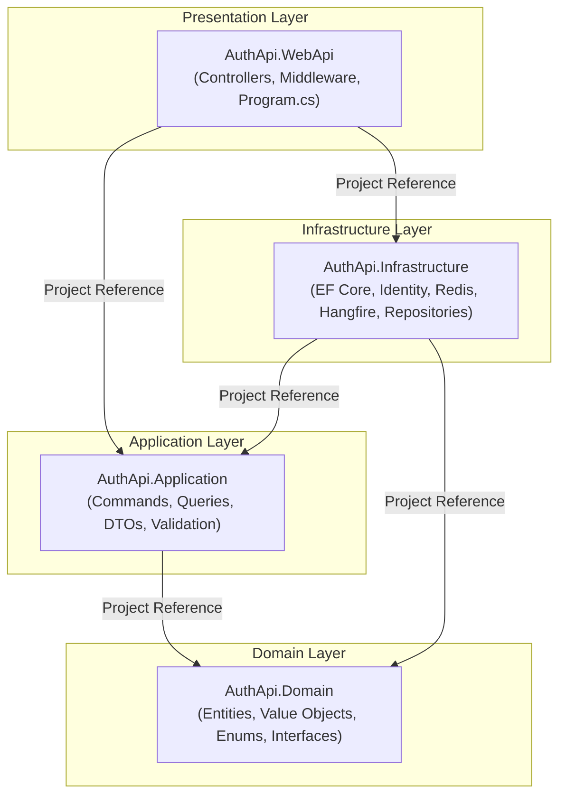
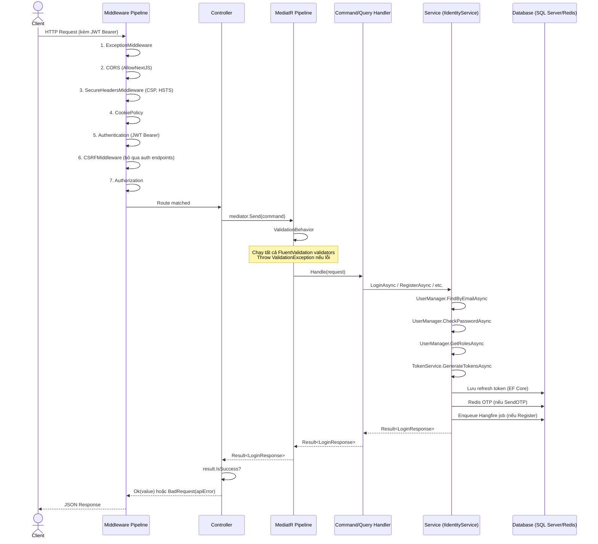

# Kiến Trúc Backend — TNP API

## Tổng Quan Dự Án

### Tên Dự Án
**Travel Now Platform (TNP) API** — File solution: `AuthApi.slnx`

### Mục Đích
Backend API cho nền tảng quản lý tài chính cá nhân & du lịch nhóm, cung cấp:
- Xác thực người dùng (đăng ký, đăng nhập, xác minh email, đặt lại mật khẩu)
- Theo dõi tài chính cá nhân (ví, giao dịch, ngân sách, danh mục, thanh toán định kỳ, mục tiêu tiết kiệm)
- Quản lý chuyến đi nhóm (lịch trình, chia chi phí, quản lý thành viên, thanh toán bù trừ)
- Chat nhóm real-time (SignalR với Redis backplane)
- Xử lý tác vụ nền (gửi email, dọn dẹp, tạo giao dịch định kỳ)

### Công Nghệ Sử Dụng

| Công nghệ | Phiên bản | Vai trò |
|-----------|-----------|---------|
| .NET | 10.0 | Runtime |
| ASP.NET Core | 10.0 | Web framework |
| Entity Framework Core | 10.0.5 | ORM — thao tác ghi |
| Microsoft.EntityFrameworkCore.SqlServer | 10.0.5 | Provider SQL Server |
| Microsoft.Data.SqlClient | 7.0.0 | Driver SQL Server |
| SQL Server | — | Database chính |
| ASP.NET Core Identity | 10.0.5 | Quản lý người dùng, băm mật khẩu, khóa tài khoản |
| JWT Bearer | 10.0.6 | Xác thực access token |
| MediatR | 12.1.1 | CQRS — commands & queries |
| FluentValidation | 12.1.1 | Kiểm tra dữ liệu đầu vào |
| Dapper | 2.1.72 | Micro-ORM — thao tác đọc + ghi |
| Hangfire | 1.8.23 | Xử lý tác vụ nền |
| StackExchange.Redis | 2.12.14 | Redis client (cache, SignalR backplane, Hangfire) |
| Swashbuckle | 10.1.7 | Swagger UI |
| SignalR | 10.0.6 | Chat real-time |
| DnsClient | 1.8.0 | Kiểm tra MX record email |

---

## Kiểu Kiến Trúc

### Hybrid: Clean Architecture + CQRS + DDD

Dự án kết hợp ba mẫu kiến trúc:

1. **Clean Architecture** (chính) — Phân tách 4 lớp, đảo ngược phụ thuộc. Domain thuần .NET; Application điều phối use case; Infrastructure triển khai các thành phần bên ngoài; WebApi trình bày.

2. **CQRS** (qua MediatR) — Thao tác ghi dùng Commands; Thao tác đọc dùng Queries. Cả đọc và ghi đều dùng **Dapper** (SqlKata đã xóa ở Me branch P2).

3. **DDD Tactical Patterns** — Entities (`BaseEntity`), Value Objects (`Email`), Aggregate Roots (`IAggregateRoot`), Domain Exceptions (`DomainException`), Domain Services (phương thức factory như `Users.Create()`).

### Tại sao kiến trúc này?
- Phân tách mối quan tâm: business rules không bao giờ phụ thuộc vào infrastructure hoặc HTTP
- Khả năng kiểm thử: Domain và Application có thể unit test không cần database
- CQRS cho phép tối ưu đọc (Dapper) riêng biệt với ghi (EF Core)
- DDD patterns giữ domain logic rõ ràng và đóng gói
- MediatR tách controller khỏi handler — thêm feature là thêm vài file, không sửa code cũ

---

## Cấu Trúc Solution

```
AuthApi.slnx
│
├── AuthApi.Domain/              # Lõi — thuần .NET, không phụ thuộc
├── AuthApi.Application/         # Use cases — chỉ tham chiếu Domain
├── AuthApi.Infrastructure/      # Triển khai — tham chiếu Application + Domain
└── AuthApi.WebApi/              # Trình bày — tham chiếu Application + Infrastructure
```

| Project | Phụ thuộc | Trách nhiệm |
|---------|-----------|-------------|
| **AuthApi.Domain** | *(không)* | Entities, value objects, enums, domain exceptions, repository interfaces, aggregate markers |
| **AuthApi.Application** | Domain | CQRS commands/queries, DTOs, FluentValidation validators, MediatR pipeline behaviors, service abstraction interfaces |
| **AuthApi.Infrastructure** | Application, Domain | EF Core DbContext, Identity implementation, Redis, Hangfire, SMTP email, JWT token generation, repository implementations |
| **AuthApi.WebApi** | Application, Infrastructure | Controllers, middlewares, Program.cs, cấu hình, Swagger |

---

## Cấu Trúc Thư Mục

```
AuthApi.Domain/
├── BaseEntity.cs                 # Lớp base abstract (Guid Id)
├── IEntity.cs                    # Interface đánh dấu
├── IAggregateRoot.cs             # Interface đánh dấu (internal)
├── IValueObject.cs               # Interface đánh dấu
├── Entities/
│   ├── Users.cs                  # Entity người dùng (domain)
│   ├── Category.cs               # Entity danh mục chi tiêu
│   └── Wallet.cs                 # Entity ví (sai namespace — đang ở Infrastructure)
├── Enums/
│   └── UserRole.cs               # User, Admin, Guest
├── Exceptions/
│   ├── DomainException.cs        # Exception cơ sở cho domain
│   └── User/
│       └── UserAgeNotValid.cs    # Kiểm tra tuổi (18-25)
├── Factories/
│   └── UsersFactory.cs           # Rỗng — placeholder
├── Interfaces/
│   └── IUserRepository.cs        # Contract repository (domain)
└── ObjectValues/
    └── Email.cs                  # Value object email kèm validation

AuthApi.Application/
├── Configuration/
│   └── DependencyInjection.cs    # Extension AddApplication()
├── Common/
│   ├── ApplicationAssembly.cs    # Marker để scan assembly
│   ├── Result.cs                 # Kiểu Result<T>
│   ├── Error.cs                  # Record Error (Code + Message)
│   ├── ErrorCodes.cs             # Hằng số mã lỗi
│   └── Behavior/
│       └── ValidationBehavior.cs # Pipeline validation cho MediatR
├── Abstractions/
│   ├── Cache/
│   │   └── ICacheService.cs               # Redis cache abstraction (MỚI)
│   └── Interfaces/
│       ├── Auth/
│       │   ├── IAuthCookieService.cs
│       │   ├── IIdentityService.cs
│       │   └── ITokenService.cs
│       ├── Email/
│       │   ├── IEmailChecker.cs            # Kiểm tra MX record
│       │   └── IEmailService.cs            # Gửi SMTP
│       └── Repositories/
│           ├── IUserReadRepository.cs      # MỚI: Dapper read
│           └── IUserWriteRepository.cs     # MỚI: Dapper write
├── Abstractions/Messaging/
│   ├── Command/
│   │   ├── ICommand.cs
│   │   └── ICommandHandler.cs
│   └── Query/
│       ├── IQuery.cs
│       └── IQueryHandler.cs
├── Common/
│   └── Security/
│       └── IUserContext.cs                 # MỚI: thay ICurrentUserService
└── Features/
    ├── Auth/Commands/
    │   ├── Login/       (LoginCommand, Handler, Validator)
    │   ├── Register/    (RegisterCommand, Handler, Validator)
    │   ├── Logout/      (LogoutCommand, Handler)
    │   ├── RefreshToken/ (RefreshTokenCommand, Handler)
    │   ├── SendOTP/     (SendOTPCommand, Handler)
    │   ├── VerifyEmail/ (VerifyEmailCommand, Handler)
    │   └── ResetPassword/ (ResetPassCommand, Handler, Validator)
    ├── Auth/DTOs/
    │   ├── AuthUserDto.cs                  # SỬA: Role→Roles[]
    │   └── Login/Register/...
    └── Users/
        ├── DTOs/
        │   ├── MeResponse.cs               # MỚI: Roles[]
        │   ├── UserDetailResponse.cs       # MỚI: admin detail
        │   └── UserListItemDto.cs          # MỚI: list item
        ├── Queries/
        │   ├── Me/MeQuery.cs + Handler     # MỚI: +Redis cache
        │   ├── GetUserById/Query + Handler # MỚI: admin
        │   └── GetAllUserQuery.cs          # SỬA: Dapper
        └── Commands/
            ├── UpdateUser/Command + Handler + Validator     # MỚI
            ├── AssignRoles/Command + Handler + Validator    # MỚI
            └── RemoveRoles/Command + Handler + Validator    # MỚI

AuthApi.Infrastructure/
├── Configuration/
│   └── DependencyInjection.cs    # Extension AddInfrastructure()
├── Common/
│   └── AppSettings.cs            # Class Options pattern
├── Identities/
│   ├── ApplicationUser.cs        # Subclass IdentityUser<Guid>
│   ├── RefreshToken.cs           # Entity refresh token tùy chỉnh
│   └── Seeds/
│       └── RoleSeeder.cs         # Seed User/Admin/Guest + admin mặc định
├── Persistence/
│   ├── Dapper/
│   │   ├── DbConnectionFactory.cs
│   │   └── Repositories/
│   │       ├── UserReadRepository.cs   # Dapper read (thay SqlKata)
│   │       └── UserWriteRepository.cs  # Dapper write (thay EF Core stub)
│   ├── AppDbContext.cs                  # EF Core (Identity internal use)
│   ├── Entities/
│   │   ├── BuildEntities.cs             # Cấu hình Fluent API
│   │   └── SeedEntitiesData.cs          # Placeholder rỗng
│   └── Repositories/Users/
│       ├── UserRepository.cs            # Đã xóa (Me branch P2)
│       └── UserQueryRepository.cs       # Đã xóa (Me branch P2)
├── Services/
│   ├── Auth/
│   │   ├── IdentityService.cs     # Điều phối xác thực
│   │   ├── HttpUserContext.cs     # MỚI: IUserContext (HTTP)
│   │   ├── UserContext.cs         # MỚI: IUserContext (Test/Background)
│   │   └── HangfireAuthFilter.cs  # Xác thực dashboard Hangfire
│   ├── Token/
│   │   ├── TokenService.cs        # JWT + refresh token
│   │   └── AuthCookieService.cs   # Đọc/ghi cookie
│   ├── Cache/
│   │   └── RedisCacheService.cs   # MỚI: ICacheService (Redis)
│   └── Email/
│       ├── EmailService.cs        # SMTP
│       ├── EmailChecker.cs        # Kiểm tra MX
│       └── EmailCleanupJob.cs     # Job Hangfire
└── Migrations/
    ├── 20260430095257_initialDbFirstCode.cs
    └── AppDbContextModelSnapshot.cs

AuthApi.WebApi/
├── Program.cs                     # Entry point, DI, middleware pipeline
├── ApiErrorResponse.cs            # Định dạng response lỗi
├── Controllers/
│   ├── AuthController.cs          # Endpoint auth (login, register, refresh...)
│   └── UserController.cs          # MỚI: Me, Detail, List, Update, Roles, Lockout
├── Middlewares/
│   ├── ExceptionMiddleware.cs     # Xử lý lỗi toàn cục
│   ├── CSRFMiddleware.cs          # Kiểm tra CSRF
│   └── SecureHeadersMiddleware.cs # Header bảo mật
├── docs/
│   └── BUSINESS_DOMAIN.md         # Yêu cầu nghiệp vụ (tiếng Việt)
├── appsettings.json
├── appsettings.Development.json
├── appsettings.Production.json
└── Properties/launchSettings.json
```

---

## Đồ Thị Phụ Thuộc



**Quy tắc:**
- `Domain` KHÔNG tham chiếu project nào (thuần .NET, không NuGet)
- `Application` chỉ tham chiếu `Domain`
- `Infrastructure` tham chiếu `Application` + `Domain`
- `WebApi` tham chiếu `Application` + `Infrastructure`
- Không thể tham chiếu ngược — Domain không biết Application/Infrastructure/WebApi

---

## Vòng Đời Xử Lý Request



### Giải Thích Từng Bước

| Bước | Thành phần | Hành động |
|------|-----------|-----------|
| 1 | **ExceptionMiddleware** | Bắt exception. `ValidationException` → 400 kèm field errors. Khác → 500 (không chi tiết). |
| 2 | **CORS** | Kiểm tra origin với config `Frontend:Url`. Cho phép credentials. |
| 3 | **SecureHeadersMiddleware** | Đặt CSP (nonce ở prod), `X-Content-Type-Options`, `X-Frame-Options`, HSTS, `Referrer-Policy`. |
| 4 | **CookiePolicy** | Cấu hình SameSite=None, Secure, HttpOnly. |
| 5 | **Authentication** | Kiểm tra JWT Bearer token. Xác thực signature, issuer, audience, expiry. Lỗi → 401 JSON. Hết hạn → set header `Token-Expired`. |
| 6 | **CSRFMiddleware** | Bỏ qua GET/HEAD/OPTIONS và auth endpoints. Với các request khác: kiểm tra cookie `CSRF-TOKEN` khớp header `X-CSRF-TOKEN`. |
| 7 | **Authorization** | Kiểm tra attribute `[Authorize]` / `[AllowAnonymous]`. |
| 8 | **Controller** | Inject `IMediator`. Gọi `mediator.Send(command)`. Trả về `Ok(value)` hoặc `BadRequest(apiError)`. |
| 9 | **ValidationBehavior** | Pipeline behavior của MediatR. Chạy tất cả `IValidator<TRequest>` đã đăng ký. Throw `ValidationException` nếu lỗi. |
| 10 | **Handler** | Mỏng: inject service interface, ủy quyền ngay (thường 1 dòng). |
| 11 | **Service** | Điều phối business logic. Dùng `UserManager`, `TokenService`, `EmailService`, `Redis`, `Hangfire`. |
| 12 | **Database** | SQL Server (EF Core cho ghi, Dapper/SqlKata cho đọc), Redis (OTP, cache, Hangfire storage). |
| 13 | **Response** | Handler trả về `Result<T>`. Controller chuyển thành HTTP response. |

---

## Middleware Pipeline

**Thứ tự trong Program.cs (phải giữ nguyên):**

```
app.UseMiddleware<ExceptionMiddleware>();        // 1 — xử lý lỗi toàn cục
app.UseHangfireDashboard();                      // 2 — UI /hangfire
app.UseCors("AllowNextJS");                      // 3 — CORS
app.UseHttpsRedirection();                       // 4 — HTTP→HTTPS
app.UseMiddleware<SecureHeadersMiddleware>();    // 5 — CSP + header bảo mật
app.UseCookiePolicy();                           // 6 — hành vi cookie
app.UseAuthentication();                         // 7 — kiểm tra JWT
app.UseMiddleware<CSRFMiddleware>();             // 8 — kiểm tra CSRF
app.UseAuthorization();                          // 9 — kiểm tra role/policy
app.MapControllers();                            // 10 — route đến controllers
```

| Middleware | Vai trò |
|-----------|---------|
| **ExceptionMiddleware** | Try/catch toàn cục. Trả về 400 cho FluentValidation errors, 500 cho mọi thứ khác. |
| **HangfireDashboard** | Phục vụ UI Hangfire tại `/hangfire`. Bảo vệ bởi `HangfireAuthFilter` (chỉ Admin). |
| **CORS** | Giới hạn origin theo cấu hình frontend URL. Cho phép credentials. |
| **HttpsRedirection** | Ép buộc HTTPS. |
| **SecureHeadersMiddleware** | Thêm `Content-Security-Policy`, `X-Content-Type-Options: nosniff`, `X-Frame-Options: DENY`, `Referrer-Policy`, `Strict-Transport-Security`. |
| **CookiePolicy** | Kiểm soát SameSite, Secure, HttpOnly cho cookie. |
| **Authentication** | Kiểm tra JWT Bearer token. Parse claims. Gán `HttpContext.User`. |
| **CSRFMiddleware** | Với POST/PUT/PATCH/DELETE (trừ auth endpoints): kiểm tra cookie `CSRF-TOKEN` khớp header `X-CSRF-TOKEN`. 403 nếu không khớp. |
| **Authorization** | Thực thi attribute `[Authorize]`. |
| **MapControllers** | Route request đến action của controller. |

---

## Xác Thực & Phân Quyền

### Loại: JWT Bearer Token (chính) + Cookie (cho refresh token + CSRF)

### Chiến Lược Token

| Token | Lưu trữ | TTL | HttpOnly | Mục đích |
|-------|---------|-----|----------|----------|
| **Access Token** (JWT) | Header `Authorization: Bearer` | **15 phút** | — | Xác thực request API |
| **Refresh Token** (ngẫu nhiên 64-byte) | Cookie `refreshToken` + DB | **30 ngày** | Có | Lấy access token mới |
| **CSRF Token** (GUID) | Cookie `CSRF-TOKEN` | **30 ngày** | Không | Chống CSRF |

### Claims trong JWT
```json
{
  "nameid": "guid-user-id",
  "email": "user@example.com",
  "unique_name": "username",
  "role": ["User", "Admin"]     // ← Multiple roles
}
```

### Luồng Đăng Nhập
```
Client                          Server
  │                                │
  │  POST /api/auth/login          │
  │  { email, password, rememberMe}│
  │──────────────────────────────>│
  │                                │
  │  1. Tìm user theo email        │
  │  2. Kiểm tra lockout (5 lần → 10 phút)
  │  3. Kiểm tra EmailConfirmed    │
  │  4. Xác minh mật khẩu          │
  │  5. Lấy roles                  │
  │  6. Tạo JWT (15 phút)          │
  │  7. Tạo refresh token (30 ngày)│
  │  8. Lưu refresh token vào DB   │
  │  9. Đặt cookies:               │
  │     - refreshToken (HttpOnly)  │
  │     - CSRF-TOKEN (không HttpOnly)
  │                                │
  │  { accessToken, expired,       │
  │    userId, email, roles }      │  // roles: string[]
  │<──────────────────────────────│
```

### Luồng Làm Mới Token
```
Client                          Server
  │                                │
  │  POST /api/auth/refresh-token  │
  │  Cookie: refreshToken=...      │
  │──────────────────────────────>│
  │  1. Đọc cookie refreshToken    │
  │  2. Tìm trong DB (chưa hết hạn, chưa thu hồi)
  │  3. Thu hồi token cũ           │
  │  4. Tìm user                   │
  │  5. Tạo JWT + refresh token mới│
  │  6. Lưu refresh token mới vào DB
  │  7. Cập nhật cookies           │
  │                                │
  │  { accessToken, expiredAt }    │
  │<──────────────────────────────│
```

### Roles & Policies
- Roles: `User`, `Admin`, `Guest` (từ enum `UserRole`)
- Được seed khi ứng dụng khởi động
- **Policy-based authorization** (sau Me branch P3):
  ```csharp
  options.AddPolicy("RequireAdmin", policy => policy.RequireRole("Admin"));
  options.AddPolicy("RequireUser", policy => policy.RequireRole("User"));
  ```
- Dashboard Hangfire chỉ cho phép role `Admin`
- **Breaking change v2:** `Role` (string) → `Roles` (string[]) trong tất cả DTOs

### Cấu Hình Identity
- Lockout: 5 lần sai, khóa 10 phút
- Mật khẩu: yêu cầu chữ số, chữ hoa, độ dài ≥ 6
- Xác nhận email bắt buộc để đăng nhập
- Thời gian sống của token (DataProtectionTokenProvider): 30 phút

---

## Dependency Injection

### Cách Đăng Ký
- **Application Layer**: `services.AddApplication()` — đăng ký MediatR handlers + FluentValidation validators + ValidationBehavior pipeline
- **Infrastructure Layer**: `services.AddInfrastructure(config, connectionString)` — đăng ký EF Core, Identity, Redis, Hangfire, Repositories, Services
- **WebApi Layer**: đăng ký thủ công (HttpContextAccessor, CORS, JWT, CookiePolicy, Swagger, AppSettings)

### Danh Sách Service

| Interface | Implementation | Lifetime | Đăng ký tại | Lý do |
|-----------|---------------|----------|-------------|-------|
| `IMediator` | `Mediator` | Scoped | AddApplication | Điều phối CQRS |
| `IPipelineBehavior<,>` | `ValidationBehavior<,>` | Transient | AddApplication | Pipeline validation MediatR |
| `IDbConnectionFactory` | `DbConnectionFactory` | Singleton | AddInfrastructure | Factory tạo kết nối Dapper (stateless) |
| `IUserReadRepository` | `UserReadRepository` | Scoped | AddInfrastructure | Dapper read (thay SqlKata) |
| `IUserWriteRepository` | `UserWriteRepository` | Scoped | AddInfrastructure | Dapper write (thay EF Core stub) |
| `IUserContext` | `HttpUserContext` | Scoped | AddInfrastructure | Security context (thay ICurrentUserService) |
| `ICacheService` | `RedisCacheService` | Singleton | AddInfrastructure | Redis cache với graceful degradation |
| `ITokenService` | `TokenService` | Scoped | AddInfrastructure | Tạo JWT + refresh token |
| `IIdentityService` | `IdentityService` | Scoped | AddInfrastructure | Điều phối xác thực |
| `IAuthCookieService` | `AuthCookieService` | Scoped | AddInfrastructure | Quản lý cookie |
| `IEmailService` | `EmailService` | Scoped | AddInfrastructure | Gửi email SMTP |
| `IEmailChecker` | `EmailChecker` | Scoped | AddInfrastructure | Kiểm tra MX record |
| `IConnectionMultiplexer` | `ConnectionMultiplexer` | Singleton | AddInfrastructure | Redis connection dùng chung |
| `IDistributedCache` | (Redis) | Singleton | AddInfrastructure | Cache Redis |
| Hangfire Server | — | Singleton | AddInfrastructure | Xử lý tác vụ nền |
| `IHttpContextAccessor` | `HttpContextAccessor` | Singleton | Program.cs | Truy cập HttpContext trong service |

---

## Thành Phần Dùng Chung

### Result\<T\>
**File**: `AuthApi.Application/Common/Result.cs`
```csharp
public class Result<T>
{
    public bool IsSuccess { get; }
    public bool IsFailure => !IsSuccess;
    public T? Value { get; }
    public Error? Error { get; }
    
    public static Result<T> Success(T value, string? message = null);
    public static Result<T> Fail(Error error);
    public static Result<T> Fail(string errorCode);
}
```
- **Xử lý lỗi kiểu hàm**: Mọi service method trả về `Result<T>` thay vì throw exception cho lỗi nghiệp vụ.
- Guarded construction: success không thể có error, failure phải có error.
- Mọi command handler trả về `Result<TResponse>`.
- Controller kiểm tra `.IsSuccess` để trả về `Ok()` hoặc `BadRequest()`.

### Error
**File**: `AuthApi.Application/Common/Error.cs`
```csharp
public record Error(string Code, string Message);
```
- Dùng với `Result<T>.Fail(Error)`.
- Code là hằng số trong `ErrorCodes` (VD: `INVALID_CREDENTIALS`, `USER_LOCKED_OUT`, `OTP_EXPIRED`).

### ApiErrorResponse
**File**: `AuthApi.WebApi/ApiErrorResponse.cs`
```csharp
public class ApiErrorResponse
{
    public string Code { get; init; }
    public string Message { get; init; }
    public IDictionary<string, string[]>? Errors { get; init; }  // null → bỏ qua trong JSON
}
```
- Được ExceptionMiddleware trả về cho mọi response lỗi.
- Dictionary `Errors` dùng cho lỗi field-level từ FluentValidation.

### BaseEntity
**File**: `AuthApi.Domain/BaseEntity.cs`
```csharp
public abstract class BaseEntity : IEntity
{
    public Guid Id { get; private set; }
    protected BaseEntity(Guid id) { ... }  // từ chối empty Guid
}
```
- Mọi domain entity đều kế thừa class này.
- ID dùng `Guid.CreateVersion7()` (UUID có thứ tự thời gian).

### Middleware Components
| Middleware | Input | Output | Tác dụng phụ |
|-----------|-------|--------|-------------|
| `ExceptionMiddleware` | Request | JSON error body | Bắt exception, ghi response |
| `SecureHeadersMiddleware` | Request | Modified response headers | Đặt CSP, HSTS, nosniff... |
| `CSRFMiddleware` | Request | 403 hoặc pass-through | Kiểm tra cookie vs header token |

---

## Cấu Hình

### Entry Point Program.cs
```csharp
// 1. Build configuration
var builder = WebApplication.CreateBuilder(args);

// 2. Đăng ký core services
builder.Services.AddControllers();
builder.Services.AddHttpContextAccessor();

// 3. Bind AppSettings options
builder.Services.Configure<AppSettings>(
    builder.Configuration.GetSection("AppSettings"));

// 4. Đăng ký DI layer
builder.Services.AddApplication()
                .AddInfrastructure(builder.Configuration, connectionString);

// 5. Cấu hình DataProtectionTokenProviderOptions (30 phút)
// 6. Cấu hình CORS (AllowNextJS)
// 7. Cấu hình JWT Bearer (với custom events)
// 8. Cấu hình CookiePolicy
// 9. Cấu hình Swagger (hỗ trợ Bearer token)

// 10. Build app
var app = builder.Build();

// 11. Seed roles + admin user khi khởi động
using (var scope = app.Services.CreateScope()) { ... RoleSeeder.SeedAsync ... }

// 12. Cấu hình middleware pipeline
if (app.Environment.IsDevelopment()) { app.UseSwagger(); }
app.UseMiddleware<ExceptionMiddleware>();
app.UseHangfireDashboard(...);
app.UseCors("AllowNextJS");
app.UseHttpsRedirection();
app.UseMiddleware<SecureHeadersMiddleware>();
app.UseCookiePolicy();
app.UseAuthentication();
app.UseMiddleware<CSRFMiddleware>();
app.UseAuthorization();
app.MapControllers();

app.Run();
```

### Nguồn Cấu Hình
| Nguồn | Mục đích |
|-------|----------|
| `appsettings.json` | Config cơ sở (logging, AllowedHosts) |
| `appsettings.Development.json` | Ghi đè cho dev (Frontend:Url = localhost:3001) |
| `appsettings.Production.json` | Ghi đè cho prod (Frontend:Url placeholder) |
| User Secrets (dev) | Giá trị nhạy cảm: connection strings, JWT keys, email credentials |
| Biến môi trường | Cấu hình production |

### Các Key Cấu Hình Quan Trọng (User Secrets hoặc env)
```
ConnectionStrings:Default        — SQL Server
ConnectionStrings:Redis          — Redis
AppSettings:JwtKey               — Khóa HMAC (32+ ký tự)
AppSettings:JwtIssuer            — VD: https://api.travelnow.com
AppSettings:JwtAudience          — VD: https://travelnow.com
Frontend:Url                     — Origin được CORS cho phép
Email:Smtp                       — SMTP host
Email:Port                       — SMTP port
Email:From                       — Địa chỉ gửi email
Email:Password                   — Mật khẩu SMTP
```

### Class AppSettings (Options Pattern)
```csharp
public class AppSettings
{
    public string FrontendUrl { get; set; }
    public string JwtKey { get; set; }
    public string JwtIssuer { get; set; }
    public string JwtAudience { get; set; }
}
```
Được bind từ section `AppSettings` trong cấu hình.

---

## Coding Convention

| Thành phần | Convention | Ví dụ |
|-----------|-----------|-------|
| **Solution** | Định dạng `.slnx` XML | `AuthApi.slnx` |
| **Đặt tên project** | `AuthApi.{Layer}` | `AuthApi.Domain` |
| **Target** | `net10.0`, `<Nullable>enable</Nullable>`, `<ImplicitUsings>enable</ImplicitUsings>` | Cả 4 project |
| **Controller** | `{Feature}Controller` | `AuthController`, `UserController` |
| **Route controller** | `[Route("api/{controller}")]` | `[Route("api/auth")]` |
| **Constructor controller** | Primary constructor với `IMediator` | `public AuthController(IMediator mediator)` |
| **Action controller** | Trả về `ActionResult<T>`, kiểm tra `result.IsSuccess` | `Ok(value)` hoặc `BadRequest(apiError)` |
| **Command** | `sealed record` trong `Features/{Module}/Commands/{Action}/` | `LoginCommand : ICommand<Result<LoginResponse>>` |
| **Query** | `sealed record` trong `Features/{Module}/Queries/{Action}/` | `GetAllUserQuery : IQuery<List<UserDto>>` |
| **Handler** | Implement `ICommandHandler<T,R>` hoặc `IQueryHandler<T,R>`, mỏng (1-2 dòng) | `LoginCommandHandler` |
| **Validator** | `AbstractValidator<T>` cùng thư mục với Command | `RegisterCommandValidator` |
| **DTO** | `sealed record` hoặc POCO trong `Features/{Module}/DTOs/` | `LoginResponse`, `RegisterResponse` |
| **Service interface** | `I{Name}Service` trong `Application/Abstractions/Interfaces/` | `IIdentityService` |
| **Service impl** | `{Name}Service` trong `Infrastructure/Services/` | `IdentityService` |
| **Repository interface** | `I{Entity}Repository` trong `Domain/Interfaces/` hoặc `Application/Abstractions/` | `IUserRepository`, `IUserQueryRepository` |
| **Repository impl** | `{Entity}Repository` trong `Infrastructure/Persistence/Repositories/` | `UserRepository` |
| **Entity** | Kế thừa `BaseEntity`, trong `Domain/Entities/` | `Users : BaseEntity, IAggregateRoot` |
| **Value Object** | Record hoặc class implement `IValueObject` | `Email` |
| **Enum** | Trong `Domain/Enums/` | `UserRole { User, Admin, Guest }` |
| **Domain exception** | Kế thừa `DomainException` | `UserAgeNotValid : DomainException` |
| **DI extension** | Static method `Add{Layer}()` | `services.AddApplication()`, `services.AddInfrastructure()` |
| **Kiểu constructor** | C# 12 primary constructors | `public class Service(IDep dep) : IService` |
| **Async** | Hậu tố `{Action}Async` | `LoginAsync`, `RegisterAsync` |
| **Trả về lỗi** | Luôn `Result<T>.Success(value)` / `Result<T>.Fail(error)` | Không bao giờ throw cho lỗi nghiệp vụ |
| **Migration** | `{timestamp}_{Name}.cs` | `20260430095257_initialDbFirstCode.cs` |
| **Sinh ID** | `Guid.CreateVersion7()` | UUID có thứ tự thời gian |
| **Comment** | Code ít comment; tài liệu nghiệp vụ bằng tiếng Việt | `docs/BUSINESS_DOMAIN.md` |
