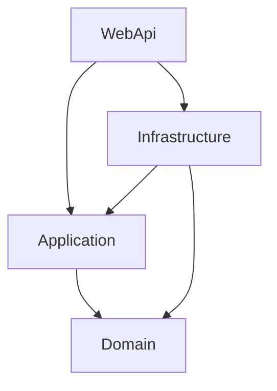
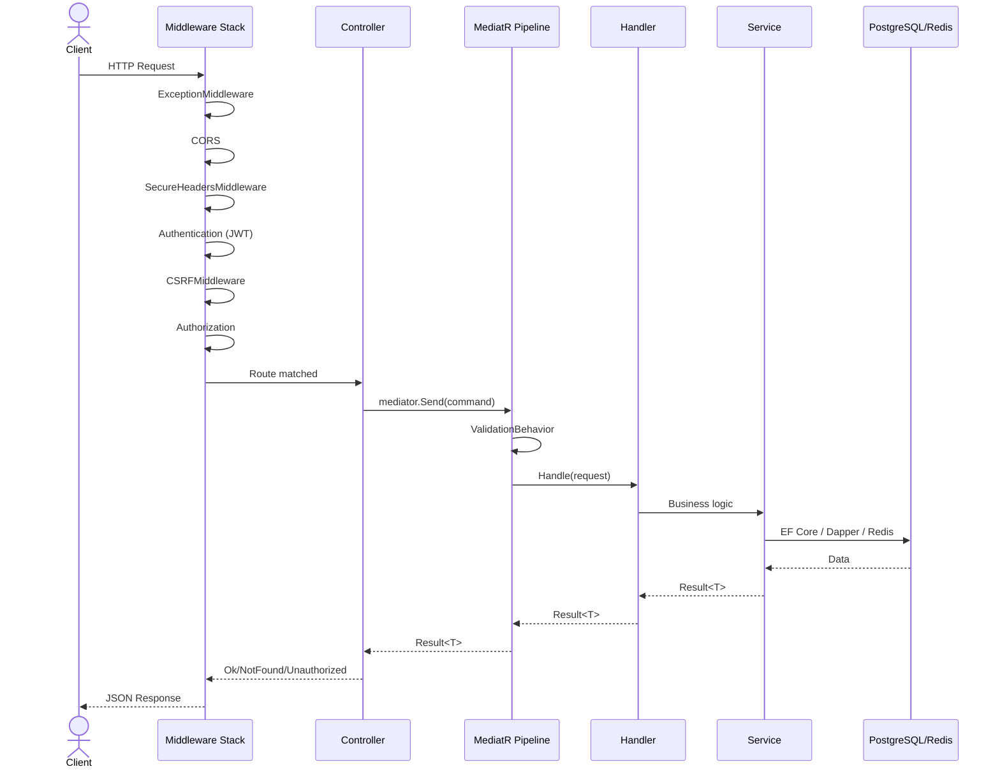
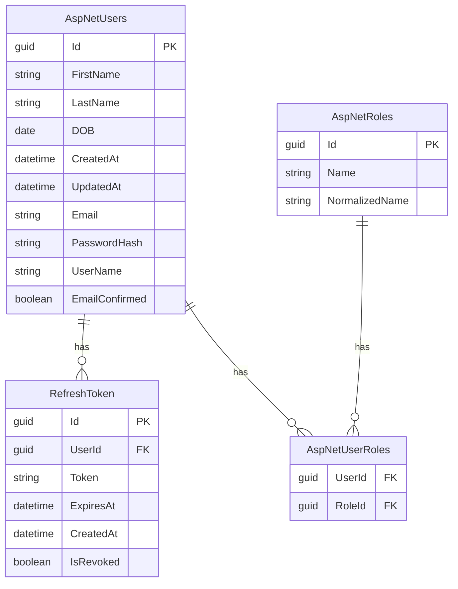

# Tài Liệu Kỹ Thuật — TNP API (AuthApi)

## 1. Tổng Quan Dự Án

### Tên Dự Án
**Travel Now Platform (TNP) API** — Solution: `AuthApi.slnx`

### Mục Đích
Backend API cho nền tảng quản lý du lịch & tài chính cá nhân. Người dùng có thể:
- Đăng ký/đăng nhập bằng email/mật khẩu (xác minh email qua OTP hoặc link xác nhận)
- Quản lý tài chính cá nhân: ví, giao dịch (thu/chi/chuyển), danh mục, ngân sách, giao dịch định kỳ, mục tiêu tiết kiệm, theo dõi nợ
- Tạo chuyến đi nhóm: quản lý thành viên, lịch trình, chia chi phí, thanh toán bù trừ, chat real-time
- Nhận thông báo: cảnh báo ngân sách, nhắc thanh toán, sự kiện hệ thống

### Công Nghệ Sử Dụng

| Công nghệ | Phiên bản | Mục đích |
|-----------|-----------|----------|
| .NET | 10.0 | Runtime & SDK |
| ASP.NET Core | 10.0 | Web framework |
| Entity Framework Core | 10.0.5 | ORM (thao tác ghi) |
| Npgsql | 10.0.1 | Driver PostgreSQL |
| PostgreSQL | — | Database chính |
| ASP.NET Core Identity | 10.0.5 | Quản lý user, băm mật khẩu, lockout |
| JWT Bearer | 10.0.6 | Xác thực access token |
| MediatR | 12.1.1 | CQRS (commands/queries) |
| FluentValidation | 12.1.1 | Kiểm tra dữ liệu |
| Dapper | 2.1.72 | Micro-ORM (đọc dữ liệu, CQRS read side) |
| SqlKata | 4.0.1 | Query builder cho đọc dữ liệu |
| Mapster | 10.0.7 | Ánh xạ đối tượng |
| Hangfire | 1.8.23 | Xử lý tác vụ nền |
| StackExchange.Redis | 2.12.14 | Redis client |
| Swashbuckle | 10.1.7 | Swagger/OpenAPI |
| SignalR | 10.0.6 | Chat real-time (Redis backplane) |
| DnsClient | 1.8.0 | Kiểm tra MX record email |

---

## 2. Kiến Trúc Tổng Quan

### Kiểu Kiến Trúc: **Clean Architecture (DDD-flavored Hybrid)**

Dự án theo **Clean Architecture** với các mẫu **Domain-Driven Design** (entities, value objects, aggregates, domain exceptions). Kết hợp **CQRS** trong Application layer qua MediatR — commands cho ghi, queries cho đọc. Phía đọc dùng Dapper/SqlKata cho hiệu năng, phía ghi dùng EF Core/Identity.

**Tại sao chọn kiến trúc này:**
- Domain layer thuần .NET, không phụ thuộc bên ngoài — business rules dễ kiểm thử và cô lập
- Application layer điều phối use cases qua MediatR handlers — mỗi feature là một vertical slice folder độc lập
- Infrastructure layer xử lý tất cả thành phần bên ngoài (DB, Redis, Hangfire, Email, Identity)
- WebApi layer mỏng: controller chỉ gọi MediatR và trả về response

### Cấu Trúc Project

| Project | Mục đích |
|---------|----------|
| `AuthApi.Domain` | Domain cốt lõi: entities, value objects, enums, interfaces (thuần .NET) |
| `AuthApi.Application` | Use cases: CQRS commands/queries, DTOs, validation, pipeline behaviors |
| `AuthApi.Infrastructure` | Triển khai: EF Core DbContext, Identity, Repositories, Services (Redis, Hangfire, Email, JWT) |
| `AuthApi.WebApi` | Presentation: Controllers, Middleware, Program.cs, Cấu hình |

```mermaid
graph TD
    subgraph "Presentation"
        WebApi[AuthApi.WebApi<br/>Controllers, Middleware]
    end
    subgraph "Application"
        Application[AuthApi.Application<br/>Commands, Queries, DTOs, Validation]
    end
    subgraph "Domain"
        Domain[AuthApi.Domain<br/>Entities, Value Objects, Enums]
    end
    subgraph "Infrastructure"
        Infrastructure[AuthApi.Infrastructure<br/>EF Core, Identity, Redis, Hangfire, Repositories]
    end

    WebApi --> Application
    WebApi --> Infrastructure
    Application --> Domain
    Infrastructure --> Application
    Infrastructure --> Domain
```

---

## 3. Đồ Thị Phụ Thuộc

```
AuthApi.WebApi (Startup)
    │
    ├── AuthApi.Application
    │       └── AuthApi.Domain
    │
    └── AuthApi.Infrastructure
            ├── AuthApi.Application
            │       └── AuthApi.Domain
            └── AuthApi.Domain
```

**Quy tắc:**
- `Domain` không tham chiếu project nào (thuần)
- `Application` chỉ tham chiếu `Domain`
- `Infrastructure` tham chiếu `Application` + `Domain`
- `WebApi` tham chiếu `Application` + `Infrastructure`
- Không cho phép tham chiếu ngược



---

## 4. Vòng Đời Xử Lý HTTP Request

```
Client Request
    │
    ▼
┌─────────────────────────────────────────┐
│  Middleware Pipeline (thứ tự quan trọng)│
│                                         │
│  1. ExceptionMiddleware                 │
│  2. HangfireDashboard                   │
│  3. CORS (AllowNextJS)                  │
│  4. HttpsRedirection                    │
│  5. SecureHeadersMiddleware (CSP, HSTS) │
│  6. CookiePolicy                        │
│  7. Authentication (JWT Bearer)         │
│  8. CSRFMiddleware                      │
│  9. Authorization                       │
│  10. MapControllers                     │
└──────────┬──────────────────────────────┘
           │
           ▼
┌──────────────────────┐
│   Controller         │
│   [ApiController]    │
│                      │
│   mediator.Send(     │
│     command/query    │
│   )                  │
└──────────┬───────────┘
           │
           ▼
┌──────────────────────┐
│  MediatR Pipeline    │
│                      │
│  ValidationBehavior  │
│  (FluentValidation)  │
└──────────┬───────────┘
           │
           ▼
┌──────────────────────┐
│  Command/Query       │
│  Handler             │
│                      │
│  → IIdentityService  │
│  → IUserRepository   │
│  → ITokenService     │
└──────────┬───────────┘
           │
           ▼
┌──────────────────────┐
│  Infrastructure     │
│  (EF Core / Dapper  │
│   / Redis / Hangfire│
│   / Identity)       │
└──────────┬───────────┘
           │
           ▼
     PostgreSQL / Redis
           │
           ▼
    Response ← JSON
```



### Giải Thích Chi Tiết

1. **ExceptionMiddleware** — bắt mọi exception không được xử lý. `ValidationException` → 400 kèm lỗi có cấu trúc. Các exception khác → 500 (không rò rỉ chi tiết).
2. **HangfireDashboard** — phục vụ UI `/hangfire`, bảo vệ bởi `HangfireAuthFilter` (chỉ Admin).
3. **CORS** — policy `AllowNextJS`: origin từ config `Frontend:Url`, cho phép credentials.
4. **HttpsRedirection** — chuyển HTTP sang HTTPS.
5. **SecureHeadersMiddleware** — đặt CSP, X-Content-Type-Options, X-Frame-Options, HSTS, Referrer-Policy.
6. **CookiePolicy** — SameSite=None, Secure tùy môi trường.
7. **Authentication** — kiểm tra JWT Bearer token. Hết hạn → header `Token-Expired`. Không hợp lệ → 401 JSON `ApiErrorResponse`.
8. **CSRFMiddleware** — bỏ qua GET/HEAD/OPTIONS và auth endpoints. Với request thay đổi dữ liệu → so sánh cookie `CSRF-TOKEN` với header `X-CSRF-TOKEN`.
9. **Authorization** — ASP.NET Core authorization tiêu chuẩn.
10. **MapControllers** — route đến controllers.
11. **Controller** — nhận `LoginCommand`/`RegisterCommand` v.v., gửi qua `IMediator`.
12. **MediatR pipeline** — `ValidationBehavior<TRequest,TResponse>` chạy tất cả FluentValidation validators trước handler.
13. **Handler** — gọi `IIdentityService`, dùng `UserManager`, `ITokenService`, `IAuthCookieService`.
14. **Service** — IdentityService điều phối UserManager (Identity), TokenService (JWT + refresh), EmailService, Redis (OTP), Hangfire.
15. **Response** — Controller trả về `IActionResult` dựa trên `Result<T>.IsSuccess`.

---

## 5. Xác Thực & Phân Quyền

### Cơ Chế
- **Chính**: JWT Bearer Token (qua header `Authorization: Bearer <token>`)
- **Refresh Token**: lưu trong HttpOnly Secure cookie (`refreshToken`)
- **CSRF Token**: lưu trong non-HttpOnly cookie (`CSRF-TOKEN`), gửi lại qua header `X-CSRF-TOKEN`
- **Access Token**: trả về trong body response, KHÔNG lưu trong cookie

### Cấu Hình JWT
- Thuật toán: HMAC-SHA256 (khóa đối xứng)
- Khóa: `AppSettings:JwtKey` (từ config/user secrets)
- Issuer: `AppSettings:JwtIssuer`
- Audience: `AppSettings:JwtAudience`
- Access token TTL: **15 phút**
- Refresh token TTL: **30 ngày** (cấu hình qua tham số `expiredDay`)
- Clock skew: 0 (nghiêm ngặt)
- RequireHttpsMetadata: true

### Claims trong JWT
```json
{
  "nameid": "<user-id>",
  "email": "<user-email>",
  "unique_name": "<user-name>",
  "role": ["User", "Admin"]
}
```

### Token Service (TokenService)
- `GenerateTokensAsync`: tạo JWT access token + refresh token ngẫu nhiên 64-byte (lưu DB + set HttpOnly cookie) + set `CSRF-TOKEN` cookie
- `RefreshTokenAsync`: đọc cookie `refreshToken` → kiểm tra DB (chưa hết hạn, chưa thu hồi) → thu hồi token cũ → phát hành cặp mới (token rotation)
- `RevokeRefreshTokenAsync`: thu hồi refresh token hiện tại (dùng khi logout)

### Roles
- Định nghĩa trong `UserRole` enum: `User`, `Admin`, `Guest`
- Được seed khi khởi động qua `RoleSeeder`
- Tài khoản admin mặc định: `nguyenthanhtuankrp1@gmail.com` / `Admin@123`
- Dashboard Hangfire chỉ cho phép role `Admin`

### Chính Sách Mật Khẩu
- Yêu cầu chữ số, chữ hoa, độ dài ≥ 6
- Lockout: 5 lần sai → khóa 10 phút
- Xác nhận email bắt buộc để đăng nhập

### Luồng Đăng Nhập
```
POST /api/auth/login
Body: { email, password, rememberMe }

1. Tìm user theo email
2. Kiểm tra lockout → trả về USER_LOCKED_OUT nếu bị khóa
3. Kiểm tra email confirmed → trả về EMAIL_NOT_CONFIRMED nếu chưa
4. Xác minh mật khẩu → tăng AccessFailedCount nếu sai, reset nếu đúng
5. Tạo JWT access token (15 phút) + refresh token (30 ngày)
6. Lưu refresh token trong bảng RefreshToken
7. Đặt cookie refreshToken (HttpOnly, Secure, SameSite=None)
8. Đặt cookie CSRF-TOKEN (non-HttpOnly)
9. Trả về LoginResponse { accessToken, expired, userId, email, role }
```

### Luồng Gọi API Sau Đăng Nhập
```
1. Client gửi: Authorization: Bearer <accessToken>
2. JWT middleware kiểm tra: signature, issuer, audience, expiry
3. Nếu token hết hạn → header Token-Expired được set
4. Client gọi POST /api/auth/refresh-token (dựa trên cookie)
5. Access token mới + refresh token mới được cấp
6. Refresh token cũ bị thu hồi (rotation)
```

### Cấu Hình Identity
- Custom `ApplicationUser` kế thừa `IdentityUser<Guid>` (khóa chính Guid)
- Trường tùy chỉnh: `FirstName`, `LastName`, `DateOfBirth`, `CreatedAt`, `UpdatedAt`
- Token providers: `DataProtectionTokenProviderOptions` (30 phút)

---

## 6. Dependency Injection

### Đăng Ký Application Layer
```csharp
// AuthApi.Application/Configuration/DependencyInjection.cs
services.AddApplication() qua extension static
```
| Interface | Implementation | Lifetime | Lý do |
|-----------|---------------|----------|-------|
| `IPipelineBehavior<,>` | `ValidationBehavior<,>` | Transient | Pipeline MediatR — không trạng thái |

MediatR handlers và FluentValidation validators được tự động đăng ký từ assembly.

### Đăng Ký Infrastructure Layer
```csharp
// AuthApi.Infrastructure/Configuration/DependencyInjection.cs
services.AddInfrastructure(config, connectionString) qua extension static
```

| Interface | Implementation | Lifetime | Lý do |
|-----------|---------------|----------|-------|
| `IDbConnection` | `SqlConnection` | Scoped | Kết nối Dapper mỗi request |
| `QueryFactory` | `QueryFactory` (SqlKata) | Scoped | Query builder phía đọc mỗi request |
| `IDbConnectionFactory` | `DbConnectionFactory` | Scoped | Factory tạo kết nối Dapper |
| `AppDbContext` | `AppDbContext` | Scoped | EF Core mặc định |
| `IUserRepository` | `UserRepository` | Scoped | Domain repository (phía ghi) |
| `IUserQueryRepository` | `UserQueryRepository` | Scoped | Query repository (phía đọc qua SqlKata) |
| `ITokenService` | `TokenService` | Scoped | Quản lý JWT + refresh token |
| `IIdentityService` | `IdentityService` | Scoped | Điều phối xác thực (login/register/logout) |
| `IAuthCookieService` | `AuthCookieService` | Scoped | Đọc/ghi cookie qua HttpContext |
| `IEmailService` | `EmailService` | Scoped | Gửi email SMTP |
| `IEmailChecker` | `EmailChecker` | Scoped | Kiểm tra MX record |
| `IConnectionMultiplexer` | `ConnectionMultiplexer` | Singleton | Redis — dùng chung toàn app |
| `IDistributedCache` | (Redis cache) | Singleton | Distributed cache từ Redis |
| Hangfire server | — | Singleton | Xử lý tác vụ nền |
| SignalR Hub | — | Singleton | Real-time với Redis backplane |

---

## 7. Thiết Kế Database

### Database Server
**PostgreSQL** qua provider Npgsql. Connection string key: `Default` trong cấu hình.

### Các Bảng Chính (từ Migration)

**AspNetUsers** (ApplicationUser tùy chỉnh)
| Cột | Kiểu | Ghi chú |
|-----|------|---------|
| Id | uuid PK | Guid |
| FirstName | varchar(50) | Bắt buộc |
| LastName | varchar(50) | Bắt buộc |
| DOB | date | Ngày sinh |
| CreatedAt | timestamptz | Mặc định UTC now |
| UpdatedAt | timestamptz | Nullable |
| UserName | varchar(256) | |
| NormalizedUserName | varchar(256) | Index unique |
| Email | varchar(256) | |
| NormalizedEmail | varchar(256) | Index |
| EmailConfirmed | boolean | |
| PasswordHash | text | |
| PhoneNumber | text | |
| LockoutEnd | timestamptz | |
| AccessFailedCount | int | |

**AspNetRoles**
| Cột | Kiểu | Ghi chú |
|-----|------|---------|
| Id | uuid PK | Guid |
| Name | varchar(256) | "User", "Admin", "Guest" |
| NormalizedName | varchar(256) | Index unique |

**RefreshToken** (entity tùy chỉnh)
| Cột | Kiểu | Ghi chú |
|-----|------|---------|
| Id | uuid PK | Guid.CreateVersion7() |
| UserId | uuid | FK đến AspNetUsers |
| Token | text | 64-byte random base64 |
| ExpiresAt | timestamptz | |
| CreatedAt | timestamptz | UTC now |
| IsRevoked | boolean | |

**Bảng Identity tiêu chuẩn**: AspNetRoleClaims, AspNetUserClaims, AspNetUserLogins, AspNetUserRoles, AspNetUserTokens

### Entity Đã Lên Kế Hoạch (từ BUSINESS_DOMAIN.md)
Các entity này đã được document nhưng CHƯA có trong code/migrations:
- Category, Wallet, Transaction, TransactionSplit, TransactionAttachment
- Budget, RecurringTransaction, SavingGoal, Debt, DebtPayment
- Tag, TransactionTag
- Trip, TripMember, TripActivity, TripExpense, TripExpenseSplit, TripSettlement
- TripChatRoom, TripMessage, Notification



---

## 8. Module Nghiệp Vụ

### 8.1 Module Xác Thực

**Mục đích**: Đăng ký, đăng nhập, đăng xuất, xác minh email, đặt lại mật khẩu.

**Các file liên quan:**
- `AuthApi.WebApi/Controllers/AuthController.cs`
- `AuthApi.Application/Features/Auth/Commands/Login/`
- `AuthApi.Application/Features/Auth/Commands/Register/`
- `AuthApi.Application/Features/Auth/Commands/Logout/`
- `AuthApi.Application/Features/Auth/Commands/RefreshToken/`
- `AuthApi.Application/Features/Auth/Commands/SendOTP/`
- `AuthApi.Application/Features/Auth/Commands/VerifyEmail/`
- `AuthApi.Application/Features/Auth/Commands/ResetPassword/`
- `AuthApi.Infrastructure/Services/Auth/IdentityService.cs`
- `AuthApi.Infrastructure/Services/Token/TokenService.cs`
- `AuthApi.Infrastructure/Services/Token/AuthCookieService.cs`

**Flow:**
1. **Register** → Validate (FluentValidation) → Tạo `ApplicationUser` qua `UserManager` → Gán role "User" → Tạo email xác nhận → Gửi email qua Hangfire → Lên lịch cleanup job (2h) xóa user chưa xác minh
2. **Login** → Validate credentials → Kiểm tra lockout/email confirmed → Tạo JWT + refresh token → Set cookies
3. **SendOTP** → Validate email → Tạo OTP 4 số → Lưu trong Redis (5 phút) → Gửi qua Hangfire email
4. **ResetPassword** → Validate OTP từ Redis → Dùng `UserManager.ResetPasswordAsync` để đặt mật khẩu mới
5. **VerifyEmail** → Dùng `UserManager.ConfirmEmailAsync` với token
6. **RefreshToken** → Đọc cookie `refreshToken` → Validate DB → Thu hồi cũ → Cấp cặp mới
7. **Logout** → Thu hồi refresh token → Xóa cookies

### 8.2 Module Người Dùng

**Mục đích**: Truy vấn dữ liệu người dùng (phía đọc).

**Các file:**
- `AuthApi.WebApi/Controllers/UserController.cs` (hiện đã comment hết)
- `AuthApi.Application/Features/Users/Queries/GetUsers/`
- `AuthApi.Infrastructure/Persistence/Repositories/Users/UserQueryRepository.cs`

**Flow:** Dùng SqlKata query builder trên bảng `AspNetUsers` → trả về `List<UserDto>`.

### 8.3 Module Du Lịch (Đã Lên Kế Hoạch)

**Mục đích**: Quản lý chuyến đi nhóm với lịch trình, chia chi phí, thanh toán.

**Quy tắc nghiệp vụ chính** (từ BUSINESS_DOMAIN.md):
- Trip là container cho mọi hoạt động, chi phí, chat, thành viên
- `total_spent` trong Trip là cache — source of truth là bảng TripExpense
- Mỗi Expense có split logic (chia đều/tùy chỉnh)
- Settlement ghi nhận thanh toán thực tế giữa các thành viên
- Soft delete + audit fields trên tất cả entity

### 8.4 Module Tài Chính (Đã Lên Kế Hoạch)

**Mục đích**: Quản lý tài chính cá nhân.

**Quy tắc nghiệp vụ chính:**
- Mỗi user nhận Wallet + Category mặc định khi đăng ký
- `Wallet.Balance` là cache — source of truth là bảng Transaction
- Transaction có 3 loại: Income, Expense, Transfer
- Transfer ảnh hưởng đến 2 wallet một cách nguyên tử qua `transfer_group_id`
- Budget theo dõi chi tiêu vs hạn mức, cảnh báo ở 80%
- Giao dịch định kỳ tự động tạo bởi cron/Hangfire

### 8.5 Module Chat Real-time (Đã Lên Kế Hoạch)

**Mục đích**: Chat nhóm cho chuyến đi với SignalR.

**Tính năng chính:**
- Một TripChatRoom trên một Trip
- Loại tin nhắn: Text, System, ActivityCard, ExpenseCard, PlaceCard
- System message tự động tạo khi có sự kiện trong chuyến đi
- Rich message với metadata JSONB
- SignalR với Redis backplane để scale ngang

---

## 9. Thành Phần Dùng Chung

### BaseEntity
**File**: `AuthApi.Domain/BaseEntity.cs`
Class abstract cơ sở cho domain entities. Cung cấp thuộc tính `Guid Id` (set qua constructor, từ chối empty GUID). Implement `IEntity`.

### IEntity / IAggregateRoot / IValueObject
**File**: `AuthApi.Domain/IEntity.cs`, `AuthApi.Domain/IAggregateRoot.cs`, `AuthApi.Domain/IValueObject.cs`
Interface đánh dấu cho DDD tactical patterns. `IAggregateRoot` là `internal` (chỉ dùng trong Domain layer).

### Result\<T\>
**File**: `AuthApi.Application/Common/Result.cs`
Kiểu kết quả kiểu hàm. Ngăn tạo success-với-error hoặc failure-không-error qua guard clauses. Dùng làm kiểu trả về cho mọi service/command handler method. Factory methods: `Success(value)`, `Fail(error)`.

### Error
**File**: `AuthApi.Application/Common/Error.cs`
Record type với `Code` + `Message`. Dùng với `Result<T>.Fail()`.

### ErrorCodes
**File**: `AuthApi.Application/Common/ErrorCodes.cs`
Hằng số cho mã lỗi: `INVALID_CREDENTIALS`, `USER_LOCKED_OUT`, `EMAIL_NOT_CONFIRMED`, `OTP_EXPIRED`, `VALIDATION_ERROR`, v.v.

### ApiErrorResponse
**File**: `AuthApi.WebApi/ApiErrorResponse.cs`
Định dạng response lỗi HTTP. Chứa `Code`, `Message`, và dictionary `Errors` tùy chọn (cho validation failures). `Errors` bị bỏ qua trong JSON khi null.

### ApplicationAssembly
**File**: `AuthApi.Application/Common/ApplicationAssembly.cs`
Class đánh dấu rỗng dùng để scan assembly (đăng ký MediatR + FluentValidation).

### DomainException
**File**: `AuthApi.Domain/Exceptions/DomainException.cs`
Exception cơ sở cho vi phạm domain rules. Ví dụ subclass: `UserAgeNotValid` (tuổi 18-25).

### Email (Value Object)
**File**: `AuthApi.Domain/ObjectValues/Email.cs`
Đóng gói validation email dùng class `MailAddress`. Factory method `Email.Create(string)`.

### CSRF Middleware
**File**: `AuthApi.WebApi/Middlewares/CSRFMiddleware.cs`
Kiểm tra CSRF token cho request thay đổi dữ liệu (POST/PUT/PATCH/DELETE), trừ auth endpoints. So sánh cookie token với header `X-CSRF-TOKEN`.

### ExceptionMiddleware
**File**: `AuthApi.WebApi/Middlewares/ExceptionMiddleware.cs`
Xử lý exception toàn cục. `ValidationException` → 400 kèm lỗi field-level. Các exception khác → 500 (không rò rỉ chi tiết).

### SecureHeadersMiddleware
**File**: `AuthApi.WebApi/Middlewares/SecureHeadersMiddleware.cs`
Đặt header bảo mật: CSP (có nonce ở production), X-Content-Type-Options, X-Frame-Options, HSTS, Referrer-Policy.

---

## 10. Cấu Hình

### appsettings.json (cơ sở)
```json
{
  "Logging": { "LogLevel": { "Default": "Information", "Microsoft.AspNetCore": "Warning" } },
  "AllowedHosts": "*"
}
```

### appsettings.Development.json
```json
{
  "Frontend": { "Url": "https://localhost:3001" },
  "Cookie": { "Secure": true }
}
```

### appsettings.Production.json
```json
{
  "Frontend": { "Url": "https://not_exist.com" },
  "Cookie": { "Secure": true }
}
```

### Cấu Hình Từ User Secrets / Biến Môi Trường
Các giá trị này **không có** trong appsettings.json, phải được cung cấp qua User Secrets hoặc biến môi trường:

| Key | Ví dụ | Mục đích |
|-----|-------|----------|
| `ConnectionStrings:Default` | `Host=...;Database=...` | Kết nối PostgreSQL |
| `ConnectionStrings:Redis` | `localhost:6379` | Kết nối Redis |
| `AppSettings:JwtKey` | Chuỗi 32+ ký tự | Khóa ký JWT |
| `AppSettings:JwtIssuer` | `https://api.travelnow.com` | Issuer JWT |
| `AppSettings:JwtAudience` | `https://travelnow.com` | Audience JWT |
| `Email:Smtp` | `smtp.gmail.com` | SMTP server |
| `Email:Port` | `587` | Cổng SMTP |
| `Email:From` | `noreply@travelnow.com` | Địa chỉ gửi email |
| `Email:Password` | `...` | Mật khẩu SMTP |

### Class AppSettings (Options Pattern)
**File**: `AuthApi.Infrastructure/Common/AppSettings.cs`
Bound từ section `AppSettings`: `FrontendUrl`, `JwtKey`, `JwtIssuer`, `JwtAudience`.

### Program.cs Cấu Hình
1. `AddApplication()` — MediatR + FluentValidation + ValidationBehavior
2. `AddInfrastructure()` — EF Core (Npgsql), Identity, Redis (cache + SignalR + Hangfire), SqlKata, Dapper, Services
3. CORS policy `AllowNextJS` (origin từ `Frontend:Url`, allow credentials)
4. JWT Bearer với custom events (OnMessageReceived, OnChallenge, OnAuthenticationFailed)
5. Cookie policy (SameSite=None, Secure)
6. Swagger hỗ trợ Bearer token
7. Thứ tự middleware pipeline
8. Seed roles khi khởi động

---

## 11. Bảo Mật

| Mục | Điểm (1-10) | Ghi chú |
|-----|-------------|---------|
| **CORS** | 8 | Giới hạn origin chặt chẽ từ config, cho phép credentials. Thiếu fallback nếu `Frontend:Url` null. |
| **Cookie** | 7 | HttpOnly cho refreshToken, Secure=true, SameSite=None. AccessToken KHÔNG đặt trong cookie. |
| **HTTPS** | 8 | Ép buộc qua `UseHttpsRedirection`. JWT yêu cầu HTTPS. CSP upgrade-insecure-requests ở prod. |
| **JWT** | 7 | HMAC-SHA256 (đối xứng — kém an toàn hơn RSA/ECDSA). Khóa lưu trong config/User Secrets. Không có JWKS endpoint. 15 phút expiry tốt. |
| **Password Hash** | 9 | ASP.NET Core Identity dùng PBKDF2. Lockout sau 5 lần. |
| **SQL Injection** | 8 | EF Core parameterizes queries. Dapper/SqlKata parameterized mặc định. Không có raw SQL. |
| **XSS** | 8 | CSP headers với nonce ở production. X-Content-Type-Options: nosniff. |
| **CSRF** | 7 | Cookie-based CSRF token. Auth endpoints được loại trừ. CSRF token là GUID đơn giản (không phải HMAC mật mã). |
| **Security Headers** | 8 | CSP, HSTS, X-Frame-Options (DENY), Referrer-Policy. CSP có placeholder domain cần thay. |
| **Rò rỉ thông tin** | 7 | 500 errors trả về message chung. FluentValidation errors trả về chi tiết field. |

### Các Vấn Đề & Cải Thiện
1. **JWT key đối xứng** trong config — cần dùng khóa 256+ bit mạnh, xoay vòng định kỳ.
2. **HSTS** chỉ áp dụng trong môi trường Development (dòng `if (isdev)` — bug, nên là `if (!isdev)`).
3. **CSP placeholder domains** cần thay bằng URL production thật.
4. **CSRF token** là GUID dễ đoán — nên dùng HMAC mật mã hoặc ít nhất `RandomNumberGenerator`.
5. **Không rate limiting** trên login/OTP endpoints.
6. **Bảng RefreshToken** không có FK constraint đến AspNetUsers (không `OnDelete` cascade).
7. **Mật khẩu admin** `Admin@123` hardcoded trong `RoleSeeder`.
8. **Không HTTPS cho development** — Cookie `Secure` flag được set bằng `isDev`.

---

## 12. Coding Convention

| Thành phần | Convention | Ví dụ |
|-----------|-----------|-------|
| **Solution** | Định dạng `.slnx` XML | `AuthApi.slnx` |
| **Đặt tên project** | `AuthApi.{Layer}` | `AuthApi.Domain`, `AuthApi.Application` |
| **Target framework** | `net10.0` | Tất cả project |
| **Nullable** | Bật | `<Nullable>enable</Nullable>` |
| **Implicit usings** | Bật | `<ImplicitUsings>enable</ImplicitUsings>` |
| **Controller** | `{Name}Controller` | `AuthController`, `UserController` |
| **Route** | `api/{controller}` | `[Route("api/auth")]` |
| **Access controller** | `[AllowAnonymous]` hoặc `[Authorize]` ở class level | AuthController là AllowAnonymous |
| **Action result** | `ActionResult<T>` | `Task<ActionResult<LoginResponse>>` |
| **Error response** | `ApiErrorResponse` | Dùng trong middleware + ProducesResponseType |
| **Command/Query** | `{Feature}{Action}Command/Query` | `LoginCommand`, `GetAllUserQuery` |
| **Command/Query record** | `sealed record` implement `ICommand<Result<T>>` | `LoginCommand(...) : ICommand<Result<LoginResponse>>` |
| **Handler** | `{Action}CommandHandler` | `LoginCommandHandler` |
| **DTO** | `{Feature}{Action}Response` cho output | `LoginResponse`, `RegisterResponse` |
| **Validator** | `{Action}CommandValidator` | `RegisterCommandValidator` |
| **Validator base** | `AbstractValidator<T>` | FluentValidation |
| **Service interface** | `I{Name}Service` | `IIdentityService`, `ITokenService` |
| **Service impl** | `{Name}Service` | `IdentityService`, `TokenService` |
| **Repository interface** | `I{Entity}Repository` | `IUserRepository`, `IUserQueryRepository` |
| **Repository impl** | `{Entity}Repository` | `UserRepository`, `UserQueryRepository` |
| **Entity** | `{Name}` (số ít) | `Users`, `Category`, `Wallet` |
| **BaseEntity** | `abstract class BaseEntity : IEntity` | |
| **Value Object** | record/class implement `IValueObject` | `Email` |
| **Enum** | `enum {Name}` trong thư mục `Enums` | `UserRole` |
| **Exception** | Subclass của `DomainException` | `UserAgeNotValid : DomainException` |
| **DI registration** | Static extension method `Add{Layer}` | `services.AddApplication()`, `services.AddInfrastructure()` |
| **MediatR pipeline** | `IPipelineBehavior<,>` | `ValidationBehavior<,>` |
| **Return Result** | `Result<T>.Success()` / `Result<T>.Fail()` | |
| **Error codes** | Hằng số trong `ErrorCodes` | `ErrorCodes.InvalidCredentials` |
| **Constructor** | Primary constructor (C# 12) | `public class Service(IDep dep) : IService` |
| **Async naming** | Hậu tố `{Action}Async` | `LoginAsync`, `RegisterAsync` |
| **Migration** | `{timestamp}_{Name}.cs` | `20260430095257_initialDbFirstCode.cs` |
| **Comment** | Tối thiểu; comment tiếng Việt có xuất hiện | |

---

## 13. Quy Tắc Ngầm (Implicit Conventions)

1. **Mọi service method đều trả về `Result<T>`** — không throw exception cho lỗi nghiệp vụ dự kiến. Exception chỉ dùng cho lỗi thực sự bất ngờ (ExceptionMiddleware bắt).
2. **Validation luôn dùng FluentValidation** — kiểm tra qua MediatR pipeline behavior. Controller KHÔNG tự validate.
3. **Controller không gọi DbContext hoặc service trực tiếp** — chỉ gọi `IMediator.Send()` hoặc inject query repository trực tiếp (ngoại lệ: UserController inject `IUserQueryRepository`).
4. **CQRS split**: Ghi đi qua Command → Handler → Service pipeline. Đọc có thể đi qua Query → Handler → QueryRepository (Dapper/SqlKata).
5. **Commands là sealed records** — bất biến, thường với `ICommand<Result<TResponse>>`.
6. **Handlers mỏng** — ủy quyền cho service ngay lập tức (handler 1 dòng).
7. **Primary constructors** được dùng khắp nơi (C# 12).
8. **Soft delete + audit fields** được lên kế hoạch cho mọi entity nghiệp vụ (`created_by_id`, `updated_by_id`, `deleted_at`).
9. **Wallet.Balance là cache** — không bao giờ tin tưởng làm source of truth. Luôn tính từ Transaction table.
10. **Business domain rules được document bằng tiếng Việt** trong BUSINESS_DOMAIN.md.
11. **Domain entities dùng `Guid.CreateVersion7()`** để sinh ID (UUID có thứ tự thời gian).
12. **FluentValidation validators được đăng ký ở HAI nơi**: Application layer (qua `AddValidatorsFromAssemblyContaining<ApplicationAssembly>()`) VÀ Infrastructure layer (qua `AddValidatorsFromAssemblyContaining<RegisterCommandValidator>()`). Đây là trùng lặp.
13. **Refresh token rotation**: mỗi lần refresh đều thu hồi token cũ và cấp token mới.
14. **Xác nhận email** bắt buộc để đăng nhập. User không xác minh trong 2 giờ sẽ bị tự động xóa (Hangfire scheduled job).
15. **Comment tiếng Việt** trong code.
16. **Auth endpoints được loại trừ khỏi CSRF** — login, register, refresh-token, logout bỏ qua CSRF check.
17. **Hangfire dashboard** ở `/hangfire` và giới hạn cho role Admin.
18. **Mapster** được khai báo trong dependencies nhưng KHÔNG được dùng. Project dùng mapping thủ công.
19. **Domain entity `Users`** (trong Domain project) tách biệt với `ApplicationUser` (trong Infrastructure). `Users` là DDD entity còn `ApplicationUser` là Identity framework entity. Cùng một concept nhưng đang disconnected.
20. **Password validation rules bị duplicate** trong cả `LoginCommandValidator` và `RegisterCommandValidator`.
21. **Connection strings** cho EF Core (Npgsql) và Dapper/SqlKata (`SqlConnection` với `SqlServerCompiler`) dùng CHUNG key `Default` nhưng provider khác nhau — EF Core dùng Npgsql (PostgreSQL), SqlKata dùng `SqlServerCompiler` (SQL Server). **Không nhất quán**.

---

## 14. Hướng Dẫn Phát Triển Feature

### Cách Thêm Feature Mới (VD: "Quản lý Category")

Làm theo checklist sau, đúng convention hiện tại:

#### 1. Domain Entity
**File**: `AuthApi.Domain/Entities/Category.cs` (đã tồn tại)
```csharp
public class Category : BaseEntity
{
    // Properties...
}
```
- Kế thừa `BaseEntity`
- Namespace `AuthApi.Domain.Entities`
- Dùng `Guid` (CreateVersion7) cho ID

#### 2. Nếu cần: Domain Repository Interface
**File**: `AuthApi.Domain/Interfaces/IUserRepository.cs` (thêm interface mới hoặc file mới)
```csharp
public interface ICategoryRepository
{
    Task<Category> AddAsync(Category category);
}
```

#### 3. Application Command/Query
**File**: `AuthApi.Application/Features/Categories/Commands/CreateCategory/CreateCategoryCommand.cs`
```csharp
public sealed record CreateCategoryCommand(...) : ICommand<Result<CreateCategoryResponse>>;
```
**File**: `AuthApi.Application/Features/Categories/Commands/CreateCategory/CreateCategoryCommandHandler.cs`
```csharp
public class CreateCategoryCommandHandler(...) : ICommandHandler<CreateCategoryCommand, Result<CreateCategoryResponse>>
{
    public async Task<Result<CreateCategoryResponse>> Handle(CreateCategoryCommand request, CancellationToken ct) { ... }
}
```
- Cấu trúc `Features/{Module}/Commands/{Action}/`
- Command là `sealed record`
- Handler ủy quyền cho service (thin handler pattern)

**Cho đọc**, tạo Query tương tự trong `Features/{Module}/Queries/{Action}/`.

#### 4. FluentValidation Validator
**File**: `AuthApi.Application/Features/Categories/Commands/CreateCategory/CreateCategoryCommandValidator.cs`
```csharp
public class CreateCategoryCommandValidator : AbstractValidator<CreateCategoryCommand>
{
    public CreateCategoryCommandValidator()
    {
        RuleFor(x => x.Name).NotEmpty();
    }
}
```
- Auto-registered qua assembly scanning (không cần DI thủ công)

#### 5. DTOs
**File**: `AuthApi.Application/Features/Categories/DTOs/CategoryDto.cs`
- Dùng `sealed record` hoặc POCO
- Đặt trong `Features/{Module}/DTOs/`

#### 6. Application Service Interface
**File**: `AuthApi.Application/Abstractions/Interfaces/Categories/ICategoryService.cs`
```csharp
public interface ICategoryService
{
    Task<Result<CategoryDto>> CreateAsync(CreateCategoryCommand command);
}
```
- Trả về `Result<T>`
- Đặt trong `Abstractions.Interfaces.{Module}`

#### 7. Infrastructure Service Implementation
**File**: `AuthApi.Infrastructure/Services/Categories/CategoryService.cs`
- Implement interface
- Dùng DbContext hoặc Dapper/SqlKata
- Đăng ký trong `AddInfrastructure()`

#### 8. Infrastructure Repository Implementation
**File**: `AuthApi.Infrastructure/Persistence/Repositories/Categories/CategoryRepository.cs`
- Implement `ICategoryRepository`
- Đăng ký trong DI

#### 9. Controller
**File**: `AuthApi.WebApi/Controllers/CategoryController.cs`
```csharp
[Route("api/categories")]
[ApiController]
[Authorize]
public class CategoryController(IMediator mediator) : ControllerBase
{
    [HttpPost]
    public async Task<ActionResult<CategoryDto>> Create(CreateCategoryCommand command)
    {
        var result = await mediator.Send(command);
        return result.IsSuccess ? Ok(result.Value) : BadRequest(new ApiErrorResponse(result.Error!));
    }
}
```
- Route: `api/{controller}`
- Inject `IMediator`
- Pattern: `result.IsSuccess` → Ok hoặc BadRequest với ApiErrorResponse

#### 10. Mapster Config
Mapster có sẵn nhưng KHÔNG được dùng. Nếu muốn dùng, cấu hình mapping trong profile class. Nếu không, mapping thủ công là convention hiện tại.

#### 11. EF Core Entity Configuration
**File**: `AuthApi.Infrastructure/Persistence/Entities/BuildEntities.cs`
Thêm cấu hình entity dùng Fluent API.

#### 12. Migration
```bash
dotnet ef migrations add CreateCategoryTable --project AuthApi.Infrastructure --startup-project AuthApi.WebApi
dotnet ef database update --project AuthApi.Infrastructure --startup-project AuthApi.WebApi
```

#### 13. Đăng Ký DI
Thêm `services.AddScoped<ICategoryService, CategoryService>()` trong `AuthApi.Infrastructure/Configuration/DependencyInjection.cs`.

---

## 15. Nợ Kỹ Thuật (Technical Debt)

### Critical

| Vấn đề | Vị trí | Ảnh hưởng | Đề xuất |
|--------|--------|-----------|---------|
| **SqlKata dùng SqlServerCompiler nhưng DB là PostgreSQL** | `DependencyInjection.cs:44` | SQL syntax sai cho PostgreSQL | Đổi thành `PostgresCompiler` |
| **HSTS bật ở dev, tắt ở prod** | `SecureHeadersMiddleware.cs:40` | Prod thiếu HSTS | Sửa thành `if (!isdev)` |
| **Controller trống (endpoint đã comment hết)** | `AuthController.cs` | Chỉ 1 endpoint login hoạt động | Mở lại hoặc xóa code chết |
| **UserController hoàn toàn bị comment** | `UserController.cs` | Không có endpoint user | Mở lại hoặc implement lại |

### High

| Vấn đề | Vị trí | Ảnh hưởng | Đề xuất |
|--------|--------|-----------|---------|
| **Factory classes rỗng** | `UsersFactory.cs`, `SeedEntitiesData.cs` | Code chết gây nhầm lẫn | Xóa hoặc implement |
| **UserRepository code stub** | `UserRepository.cs` | `AddAsync` và `GetUserByIdAsync` trả data giả | Implement đúng hoặc xóa |
| **Domain entity `Users` disconnected với Identity `ApplicationUser`** | Domain vs Infrastructure | Hai đại diện cho cùng concept → mất đồng bộ | Map giữa chúng hoặc merge |
| **Validation đăng ký từ hai assembly** | Application + Infrastructure DI | Trùng lặp đăng ký | Bỏ một |
| **Password rules bị duplicate** | `LoginCommandValidator` + `RegisterCommandValidator` | Vi phạm DRY | Tách shared validator base |
| **Tên tham số primary constructor không nhất quán** | `IdentityService` vs `TokenService` | Không đồng bộ convention | Chuẩn hóa suffix pattern |

### Medium

| Vấn đề | Vị trí | Ảnh hưởng | Đề xuất |
|--------|--------|-----------|---------|
| **Hardcoded admin email/password** | `RoleSeeder.cs` | Rủi ro bảo mật trong production | Dùng config/biến môi trường |
| **Không rate limiting** trên auth endpoints | — | Lỗ hổng brute force | Thêm rate limiting middleware |
| **Không API versioning** | — | Breaking changes khó quản lý | Thêm `ApiVersion` attributes |
| **Không logging (Serilog khai báo nhưng chưa cấu hình)** | `.csproj` không có Serilog package | Không có structured logging | Thêm Serilog sink |
| **RefreshToken không có FK đến AspNetUsers** | Migration | Token mồ côi | Thêm FK + cascade delete |
| **Wallet entity sai namespace** | `Infrastructure.Persistence.Entities` | Phải ở `Domain.Entities` | Di chuyển |
| **Mapster không dùng** | `.csproj` khai báo Mapster | Dependency không cần thiết | Xóa hoặc bắt đầu dùng |

### Low

| Vấn đề | Vị trí | Ảnh hưởng | Đề xuất |
|--------|--------|-----------|---------|
| **Comment tiếng Việt** | Nhiều file | Giảm tiếp cận cho dev quốc tế | Dịch sang Anh hoặc xóa |
| **Typo `allowedHosts`** | `appsettings.json` "AllowedHosts" | Hình thức | Sửa thành "AllowedHosts" |
| **Typo tên class** | `LoginCommandhandler` (chữ 'h' thường) | Không nhất quán | Đổi thành `LoginCommandHandler` |
| **File `RefeshTokenCommand`** không tìm thấy | Application layer | Thiếu file | Tạo hoặc xóa tham chiếu |
| **Unused `using` statements** | Nhiều file | Vệ sinh code | Chạy `dotnet format` |

---

## 16. Tóm Tắt Ngữ Cảnh AI

Bên dưới là tài liệu tham khảo kỹ thuật cô đọng (~1400 từ) cho phát triển AI-assisted trên dự án này.

---

```
# TNP API (AuthApi) — Ngữ Cảnh Phát Triển AI

## Nhận Diện Dự Án
- **Tên**: Travel Now Platform (TNP) API
- **Solution**: AuthApi.slnx (4 projects)
- **Target**: .NET 10.0
- **Database**: PostgreSQL (Npgsql) + Redis
- **Auth**: JWT Bearer (HMAC-SHA256, 15 phút) + Refresh Token (30 ngày, cookie) + CSRF Token

## Kiến Trúc
- **Clean Architecture** với CQRS (MediatR)
- **4 layers**: Domain → Application → Infrastructure → WebApi
- **Phụ thuộc**: Domain (thuần) ← Application ← Infrastructure ← WebApi
- **WebApi tham chiếu** Application + Infrastructure
- **Không tham chiếu ngược**

## Công Nghệ Chính
- ASP.NET Core Identity (Guid PK, custom ApplicationUser FirstName/LastName/DOB)
- Entity Framework Core 10 + Npgsql (phía ghi)
- Dapper + SqlKata (phía đọc) — NHƯNG SqlKata dùng SqlServerCompiler còn DB là PostgreSQL (bug)
- MediatR 12 (CQRS), FluentValidation 12 (pipeline validation)
- Hangfire (tác vụ nền: email, cleanup, định kỳ)
- Redis (cache, SignalR backplane, Hangfire storage, OTP storage)
- SignalR (kế hoạch cho chat real-time)
- Mapster (cài nhưng chưa dùng — mapping thủ công)

## Cấu Trúc Project Convention
```
Domain/
  Entities/{Entity}.cs         → Domain entity (subclass BaseEntity)
  Enums/{Enum}.cs              → UserRole (User, Admin, Guest)
  Interfaces/I{Entity}Repository.cs
  ObjectValues/{VO}.cs         → Value objects (Email)
  Exceptions/DomainException.cs

Application/
  Features/{Module}/Commands/{Action}/{Action}Command.cs
  Features/{Module}/Commands/{Action}/{Action}CommandHandler.cs
  Features/{Module}/Commands/{Action}/{Action}CommandValidator.cs
  Features/{Module}/Queries/{Action}/...
  Features/{Module}/DTOs/{Dto}.cs
  Abstractions/Interfaces/{Module}/I{Name}Service.cs
  Common/Result.cs, Error.cs, ErrorCodes.cs
  Common/Behavior/ValidationBehavior.cs

Infrastructure/
  Services/{Module}/{Name}Service.cs     → Implement Application interfaces
  Persistence/AppDbContext.cs             → EF Core DbContext
  Persistence/Repositories/{Entity}/{Name}Repository.cs
  Persistence/Entities/BuildEntities.cs   → Fluent API config
  Identities/ApplicationUser.cs           → IdentityUser<Guid> subclass
  Identities/RefreshToken.cs              → Custom table
  Identities/Seeds/RoleSeeder.cs          → Seed khi khởi động
  Common/AppSettings.cs                   → Options pattern

WebApi/
  Controllers/{Name}Controller.cs
  Middlewares/{Name}Middleware.cs
  Program.cs
  ApiErrorResponse.cs
```

## Vòng Đời Request
1. ExceptionMiddleware → HTTPs → SecureHeaders → Authentication → CSRF → Authorization → Controller → MediatR.Send() → ValidationBehavior → Handler → Service → DB/Redis → Result<T> → Response JSON

## Quy Tắc Convention (PHẢI THEO)
1. **Controllers** inject `IMediator`, gọi `mediator.Send(command)`, kiểm tra `result.IsSuccess`, trả `Ok(value)` hoặc `BadRequest(new ApiErrorResponse(result.Error!))`
2. **Mọi method** trả về `Result<T>` — không throw cho lỗi nghiệp vụ
3. **Commands** là `sealed record` implement `ICommand<Result<TResponse>>`
4. **Handlers** mỏng (ủy quyền service 1-2 dòng)
5. **Validation** chỉ qua FluentValidation — auto-registered, không cần DI thủ công
6. **Primary constructors** (C# 12): `public class Service(IDep dep) : IService`
7. **DTOs** dùng `sealed record` hoặc POCO
8. **Services** dùng `_field` naming cho primary constructor params
9. **Mọi entity** dùng `Guid.CreateVersion7()` cho ID
10. **Soft delete + audit fields** (`created_by_id`, `updated_by_id`, `deleted_at`) cho mọi business table

## Auth Flow
- **Login**: email/password → UserManager check → JWT (15m, body) + refresh token (30d, HttpOnly cookie) + CSRF token (non-HttpOnly cookie)
- **Refresh**: POST /api/auth/refresh-token → đọc cookie `refreshToken` → validate DB → thu hồi cũ → cấp mới
- **Logout**: thu hồi refresh token → xóa cookies
- **CSRF**: cookie `CSRF-TOKEN` vs header `X-CSRF-TOKEN` cho request thay đổi (bỏ qua auth endpoints)
- **Register**: Tạo user → gán role "User" → gửi email xác nhận → schedule cleanup (2h auto-delete nếu chưa xác minh)
- **Reset Password**: OTP qua email → lưu Redis (5 phút) → xác minh trước khi đặt lại

## Database Tables (Hiện tại)
- **AspNetUsers** (custom: FirstName, LastName, DOB, CreatedAt, UpdatedAt)
- **AspNetRoles** (User, Admin, Guest — seeded)
- **RefreshToken** (Token, UserId, ExpiresAt, IsRevoked)
- Identity standard: RoleClaims, UserClaims, UserLogins, UserRoles, UserTokens

## Business Modules Đã Lên Kế Hoạch
- **Travel**: Trip, TripMember, TripActivity, TripExpense, TripExpenseSplit, TripSettlement, TripChatRoom, TripMessage
- **Financial**: Wallet, Transaction, Category, Budget, RecurringTransaction, SavingGoal, Debt, Tag, Notification
- **Chat**: SignalR real-time với Redis backplane

## Lưu Ý Bảo Mật
- HSTS bị BUG: chỉ bật ở dev, không ở prod
- CSRF token là GUID (không mật mã)
- Không rate limiting trên auth endpoints
- Admin password hardcoded trong RoleSeeder
- CSP có placeholder domains cần thay

## Thêm Feature Mới (Checklist)
1. Domain Entity (Domain/Entities/)
2. Domain Repository Interface (Domain/Interfaces/)
3. Command/Query (Application/Features/{Module}/Commands|Queries/{Action}/)
4. FluentValidation Validator (cùng thư mục với Command)
5. DTO (Application/Features/{Module}/DTOs/)
6. Service Interface (Application/Abstractions/Interfaces/)
7. Service Implementation (Infrastructure/Services/)
8. Repository Implementation (Infrastructure/Persistence/Repositories/)
9. Controller (WebApi/Controllers/)
10. DI Registration (trong AddInfrastructure extension)
11. EF Config + Migration

## Bug Critical Đã Biết
1. SqlKata dùng SqlServerCompiler nhưng database là PostgreSQL → đổi thành PostgresCompiler
2. HSTS chỉ bật ở dev (sai condition trong SecureHeadersMiddleware)
3. AuthController chỉ còn login endpoint hoạt động — tất cả khác bị comment
4. UserRepository trả stub, không phải data thật
5. Validation đăng ký từ cả Application và Infrastructure assemblies (duplicate)

## Coding Style
- Target: net10.0, Nullable enabled, ImplicitUsings enabled
- Controller route: `[Route("api/{controller}")]`
- Error response: `ApiErrorResponse { Code, Message, Errors? }`
- API returns: `ActionResult<T>` với `[ProducesResponseType]` attributes
- Tất cả project dùng file-scoped namespaces
```
