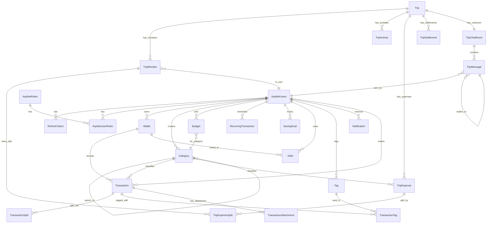
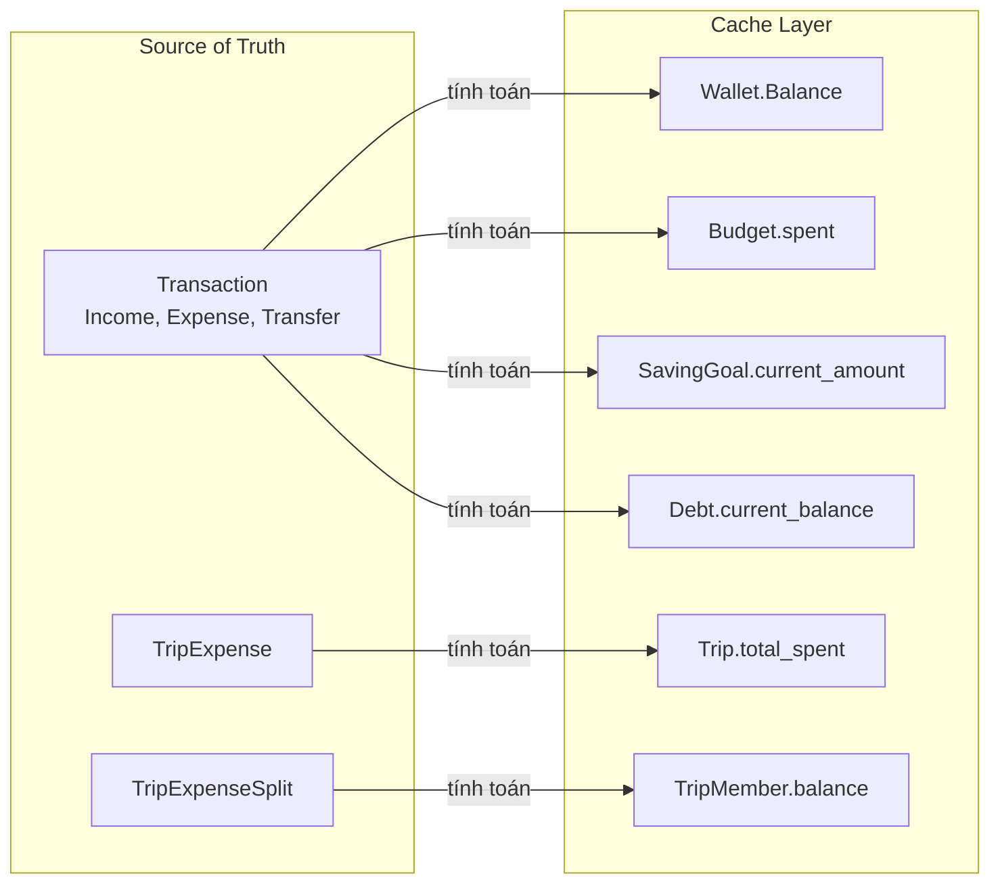

# Database Schema — TNP API

## Tổng Quan

Dự án sử dụng **SQL Server** (qua `Microsoft.EntityFrameworkCore.SqlServer` / `Microsoft.Data.SqlClient`) làm database chính và **Redis** cho caching/token lưu trữ tạm. ORM chính là **Entity Framework Core 10** (cho thao tác ghi) kết hợp **Dapper** (cho thao tác đọc).

**Database gồm 3 trạng thái entity:**
1. **Đã migrate** — bảng tồn tại trong database (Identity + RefreshToken)
2. **Domain entity (code)** — đã có class C# nhưng chưa có migration
3. **Planned (document)** — đã design trong BUSINESS_DOMAIN.md, chưa có code

---

## 1. Main Entities

### 1.1 Entities Đã Migrate (tồn tại trong DB)

#### AspNetUsers (ApplicationUser)
Bảng người dùng, kế thừa từ ASP.NET Core Identity.

| Column | Type | Constraints | Notes |
|--------|------|-------------|-------|
| `Id` | `uuid` | PK | Guid |
| `FirstName` | `varchar(50)` | NOT NULL | Tên |
| `LastName` | `varchar(50)` | NOT NULL | Họ |
| `DOB` | `date` | NOT NULL | Ngày sinh |
| `CreatedAt` | `timestamptz` | NOT NULL | DEFAULT UTC now |
| `UpdatedAt` | `timestamptz` | NULL | |
| `UserName` | `varchar(256)` | NULL | |
| `NormalizedUserName` | `varchar(256)` | UNIQUE INDEX | |
| `Email` | `varchar(256)` | NULL | |
| `NormalizedEmail` | `varchar(256)` | INDEX | |
| `EmailConfirmed` | `boolean` | NOT NULL | |
| `PasswordHash` | `text` | NULL | |
| `PhoneNumber` | `text` | NULL | |
| `LockoutEnd` | `timestamptz` | NULL | |
| `LockoutEnabled` | `boolean` | NOT NULL | |
| `AccessFailedCount` | `integer` | NOT NULL | |

#### AspNetRoles
| Column | Type | Constraints | Notes |
|--------|------|-------------|-------|
| `Id` | `uuid` | PK | Guid |
| `Name` | `varchar(256)` | NULL | "User", "Admin", "Guest" |
| `NormalizedName` | `varchar(256)` | UNIQUE INDEX | |
| `ConcurrencyStamp` | `text` | NULL | |

#### RefreshToken (custom)
| Column | Type | Constraints | Notes |
|--------|------|-------------|-------|
| `Id` | `uuid` | PK | Guid.CreateVersion7() |
| `UserId` | `uuid` | FK → AspNetUsers | **Không có ON DELETE CASCADE** |
| `Token` | `text` | NOT NULL | 64-byte random base64 |
| `ExpiresAt` | `timestamptz` | NOT NULL | |
| `CreatedAt` | `timestamptz` | NOT NULL | |
| `IsRevoked` | `boolean` | NOT NULL | |

#### Identity Join Tables
- `AspNetRoleClaims` (Id PK, RoleId FK, ClaimType, ClaimValue)
- `AspNetUserClaims` (Id PK, UserId FK, ClaimType, ClaimValue)
- `AspNetUserLogins` (LoginProvider + ProviderKey PK, UserId FK)
- `AspNetUserRoles` (UserId + RoleId PK, dual FK)
- `AspNetUserTokens` (UserId + LoginProvider + Name PK)

---

### 1.2 Domain Entities (code đã có, chưa migrate)

#### Users (Domain Entity)
**File**: `AuthApi.Domain/Entities/Users.cs`
Entity DDD riêng, khác biệt với ApplicationUser. Đại diện cho user domain.

| Property | Type | Notes |
|----------|------|-------|
| `Id` | `Guid` | BaseEntity |
| `Role` | `UserRole` (enum) | User, Admin, Guest |
| `Name` | `string` | Trimmed |

**Business meaning**: Domain entity cho nghiệp vụ User. Hiện tại disconnected với ApplicationUser (Identity). Cần mapping hoặc merge.

#### Category
**File**: `AuthApi.Domain/Entities/Category.cs`

| Property | Type | Notes |
|----------|------|-------|
| `Id` | `Guid` | BaseEntity |
| `UserId` | `Guid?` | NULL = system default |
| `User` | `Users?` | Navigation |
| `Name` | `string` | |
| `Type` | `string` | "Expense" hoặc "Income" |
| `Icon` | `string?` | |
| `Color` | `string?` | |
| `ParentCategoryId` | `Guid?` | Self-referencing hierarchy |
| `ParentCategory` | `Category?` | Navigation |
| `SubCategories` | `ICollection<Category>` | Navigation |

**Business meaning**: Phân loại thu/chi. Hỗ trợ system default (UserId = NULL) và user custom. Phân cấp cha-con.

#### Wallet
**File**: `AuthApi.Infrastructure/Persistence/Entities/Wallet.cs` (sai namespace)

| Property | Type | Notes |
|----------|------|-------|
| `Id` | `Guid` | BaseEntity |
| `UserId` | `Guid` | FK → Users |
| `User` | `Users` | Navigation |
| `Name` | `string` | |
| `Balance` | `decimal` | **Cache only** |
| `Currency` | `string` | Mặc định "VND" |
| `Type` | `string` | Cash, Bank, Credit |

**Business meaning**: Ví/tài khoản của user. Balance là cache — source of truth là Transaction.

---

### 1.3 Planned Entities (document trong BUSINESS_DOMAIN.md)

#### FINANCIAL MODULE

##### Transaction — Source of Truth Trung Tâm
Bảng quan trọng nhất. Ghi nhận mọi thu/chi/chuyển tiền.

| Field | Type | Notes |
|-------|------|-------|
| `id` | UUID PK | |
| `user_id` | FK → Users | |
| `wallet_id` | FK → Wallet | Ví chính |
| `from_wallet_id` | FK → Wallet, NULL | Dùng cho Transfer |
| `to_wallet_id` | FK → Wallet, NULL | Dùng cho Transfer |
| `transfer_group_id` | UUID, NULL | Nhóm 2 transaction của 1 lần chuyển |
| `category_id` | FK → Category | |
| `amount` | DECIMAL(18,2) | Luôn dương |
| `currency` | VARCHAR(3) | |
| `type` | ENUM | Income, Expense, Transfer |
| `note` | TEXT | |
| `transaction_date` | DATE | Ngày thực tế |
| `created_at` | TIMESTAMPTZ | Audit |
| `deleted_at` | TIMESTAMPTZ | Soft delete |

**Business meaning**: Mọi chuyển động tiền đều ghi vào đây. Wallet.balance, Budget.spent, SavingGoal.current_amount đều là cache tính từ Transaction.

##### TransactionSplit
| Field | Type | Notes |
|-------|------|-------|
| `id` | UUID PK | |
| `transaction_id` | FK → Transaction | |
| `category_id` | FK → Category | |
| `amount` | DECIMAL | |
| `note` | VARCHAR(255) | |

**Business meaning**: Chia một giao dịch vào nhiều danh mục (VD: hóa đơn siêu thị gồm đồ ăn + đồ gia dụng).

##### Budget
| Field | Type | Notes |
|-------|------|-------|
| `id` | UUID PK | |
| `user_id` | FK → Users | |
| `category_id` | FK → Category | |
| `amount_limit` | DECIMAL | |
| `period` | ENUM | Monthly, Weekly, Yearly |
| `start_date` | DATE | |
| `spent` | DECIMAL | **Cache** — tính từ Transaction |
| `created_at` | TIMESTAMPTZ | Audit |
| `deleted_at` | TIMESTAMPTZ | Soft delete |

**Business meaning**: Giới hạn chi tiêu theo danh mục trong kỳ. `spent` là cache.

##### RecurringTransaction
| Field | Type | Notes |
|-------|------|-------|
| `id` | UUID PK | |
| `user_id` | FK → Users | |
| `wallet_id` | FK → Wallet | |
| `category_id` | FK → Category | |
| `amount` | DECIMAL | |
| `type` | ENUM | Income, Expense, Transfer |
| `frequency` | ENUM | Daily, Weekly, Monthly, Yearly |
| `next_execution_date` | DATE | |
| `is_active` | BOOLEAN | |
| `end_date` | DATE | NULL = vô hạn |

**Business meaning**: Giao dịch tự động lặp lại (lương, tiền nhà, Netflix). Hangfire cron job quét và tạo Transaction.

##### SavingGoal
| Field | Type | Notes |
|-------|------|-------|
| `id` | UUID PK | |
| `user_id` | FK → Users | |
| `name` | VARCHAR | |
| `target_amount` | DECIMAL | |
| `current_amount` | DECIMAL | **Cache** |
| `target_date` | DATE, NULL | |
| `wallet_id` | FK → Wallet, NULL | |

**Business meaning**: Mục tiêu tiết kiệm. `current_amount` là cache.

##### Debt
| Field | Type | Notes |
|-------|------|-------|
| `id` | UUID PK | |
| `user_id` | FK → Users | |
| `wallet_id` | FK → Wallet | |
| `name` | VARCHAR | |
| `initial_amount` | DECIMAL | |
| `current_balance` | DECIMAL | **Cache** |
| `interest_rate` | DECIMAL | |
| `due_date` | DATE | |
| `type` | ENUM | CreditCard, PersonalLoan, Mortgage |

**Business meaning**: Quản lý nợ (thẻ tín dụng, vay). `current_balance` là cache.

##### DebtPayment
| Field | Type | Notes |
|-------|------|-------|
| `id` | UUID PK | |
| `debt_id` | FK → Debt | |
| `amount` | DECIMAL | |
| `payment_date` | DATE | Ngày trả thực tế |
| `note` | TEXT | |
| `created_at` | TIMESTAMPTZ | Audit |
| `created_by_id` | UUID FK → Users | User ghi nhận |

**Business meaning**: Lịch sử các lần trả nợ. `Debt.current_balance` = `initial_amount` - SUM(`DebtPayment.amount`). Cần bảng này để audit và khôi phục nếu cache bị sai.

##### Tag / TransactionTag
**Tag**
| Field | Type | Notes |
|-------|------|-------|
| `id` | UUID PK | |
| `user_id` | FK → Users | |
| `name` | VARCHAR | |
**TransactionTag** (junction)
| Field | Type |
|-------|------|
| `transaction_id` | FK → Transaction |
| `tag_id` | FK → Tag |

**Business meaning**: Tag do user tự tạo, phân loại giao dịch linh hoạt.

##### TransactionAttachment
| Field | Type | Notes |
|-------|------|-------|
| `id` | UUID PK | |
| `transaction_id` | FK → Transaction | |
| `file_url` | TEXT | |
| `created_at` | TIMESTAMPTZ | |

**Business meaning**: File đính kèm (hóa đơn, biên lai) cho giao dịch.

##### Notification
| Field | Type | Notes |
|-------|------|-------|
| `id` | UUID PK | |
| `user_id` | FK → Users | |
| `title` | VARCHAR | |
| `message` | TEXT | |
| `is_read` | BOOLEAN | |
| `created_at` | TIMESTAMPTZ | |

**Business meaning**: Thông báo hệ thống (cảnh báo ngân sách, nhắc thanh toán).

#### TRAVEL MODULE

##### Trip — Aggregate Root của Travel Module
| Field | Type | Notes |
|-------|------|-------|
| `id` | ULID PK | |
| `name` | VARCHAR | |
| `description` | TEXT, NULL | |
| `start_date` | DATE | |
| `end_date` | DATE | |
| `destination` | VARCHAR(255) | |
| `status` | ENUM | Planning, Ongoing, Completed, Cancelled |
| `total_spent` | DECIMAL(18,2) | **Cache only** |
| `created_by_id` | FK → Users | Organizer |
| `created_at` | TIMESTAMPTZ | Audit |
| `deleted_at` | TIMESTAMPTZ | Soft delete |

**Business meaning**: Container cho một chuyến du lịch nhóm. Chứa itinerary, members, expenses, chat.

##### TripMember
| Field | Type | Notes |
|-------|------|-------|
| `id` | ULID PK | |
| `trip_id` | FK → Trip | |
| `user_id` | FK → Users | |
| `role` | ENUM | Organizer, Member, Viewer |
| `invitation_status` | ENUM | Pending, Accepted, Declined |
| `joined_at` | TIMESTAMPTZ | |
| `balance` | DECIMAL(18,2) | **Cache**: dương = được nhận, âm = còn nợ |
| `color` | VARCHAR(7) | Màu UI |

**Business meaning**: Thành viên của chuyến đi. `balance` là cache tính từ TripExpenseSplit.

##### TripActivity
| Field | Type | Notes |
|-------|------|-------|
| `id` | ULID PK | |
| `trip_id` | FK → Trip | |
| `activity_date` | DATE | |
| `title` | VARCHAR | |
| `description` | TEXT, NULL | |
| `location` | VARCHAR(500) | |
| `start_time` | TIME, NULL | |
| `end_time` | TIME, NULL | |
| `category` | ENUM | Sightseeing, Food, Transport, Accommodation, Other |
| `cost_estimate` | DECIMAL(18,2), NULL | |
| `status` | ENUM | Planned, Done, Cancelled |
| `order` | INT | Thứ tự sắp xếp |
| `created_at` | TIMESTAMPTZ | Audit |
| `deleted_at` | TIMESTAMPTZ | Soft delete |

**Business meaning**: Hoạt động trong lịch trình chuyến đi, tổ chức theo ngày.

##### TripExpense
| Field | Type | Notes |
|-------|------|-------|
| `id` | ULID PK | |
| `trip_id` | FK → Trip | |
| `paid_by_id` | FK → TripMember | Người trả tiền |
| `category_id` | FK → Category, NULL | |
| `amount` | DECIMAL(18,2) | Số tiền trong `currency` gốc |
| `currency` | VARCHAR(3) | Mã tiền tệ gốc (VD: 'VND', 'USD'), default 'VND' |
| `exchange_rate_to_trip_currency` | DECIMAL(18,6), NULL | Tỷ giá quy đổi về `trip_currency` tại `expense_date` |
| `amount_in_trip_currency` | DECIMAL(18,2), NULL | Amount đã quy đổi, NULL nếu currency == trip_currency |
| `note` | TEXT | |
| `expense_date` | DATE | |
| `location` | VARCHAR(255), NULL | |
| `is_settled` | BOOLEAN | |
| `created_at` | TIMESTAMPTZ | Audit |
| `deleted_at` | TIMESTAMPTZ | Soft delete |

**Business meaning**: Chi tiêu nhóm trong chuyến đi. Kết nối Travel ↔ Financial. Hỗ trợ multi-currency với auto-convert về `trip_currency`.

##### TripExpenseSplit
| Field | Type | Notes |
|-------|------|-------|
| `id` | ULID PK | |
| `trip_expense_id` | FK → TripExpense | |
| `trip_member_id` | FK → TripMember | |
| `share_amount` | DECIMAL(18,2) | |
| `note` | VARCHAR(255), NULL | |

**Business meaning**: Chi tiết phân bổ chi phí cho từng thành viên. Tổng các split = TripExpense.amount.

##### TripSettlement
| Field | Type | Notes |
|-------|------|-------|
| `id` | ULID PK | |
| `trip_id` | FK → Trip | |
| `from_member_id` | FK → TripMember | Người nợ |
| `to_member_id` | FK → TripMember | Người được nợ |
| `amount` | DECIMAL(18,2) | |
| `settled_date` | DATE | |
| `status` | ENUM | Pending, Completed, Cancelled |
| `note` | TEXT | |

**Business meaning**: Ghi nhận thanh toán thực tế giữa các thành viên để dứt điểm nợ.

#### CHAT MODULE

##### TripChatRoom
| Field | Type | Notes |
|-------|------|-------|
| `id` | ULID PK | |
| `trip_id` | FK → Trip (UNIQUE) | 1-1 với Trip |
| `created_at` | TIMESTAMPTZ | |
| `created_by_id` | FK → Users | |

**Business meaning**: Một phòng chat duy nhất cho mỗi Trip.

##### TripMessage
| Field | Type | Notes |
|-------|------|-------|
| `id` | ULID PK | |
| `trip_chat_room_id` | FK → TripChatRoom | |
| `sender_id` | FK → Users, NULL | NULL = System Message |
| `message_type` | ENUM | Text, System, ActivityCard, ExpenseCard, PlaceCard |
| `content` | TEXT | |
| `metadata` | JSONB | Dữ liệu rich message |
| `reply_to_id` | FK → TripMessage, NULL | |
| `is_edited` | BOOLEAN | |
| `created_at` | TIMESTAMPTZ | |
| `deleted_at` | TIMESTAMPTZ | Soft delete |

**Business meaning**: Tin nhắn chat. Hỗ trợ rich content qua metadata JSONB.

**Metadata schema theo `message_type`:**
- `ActivityCard`: `{ "activityId": "ulid", "activityDate": "2026-06-16", "title": "...", "location": "...", "startTime": "08:00" }`
- `ExpenseCard`: `{ "expenseId": "ulid", "amount": 1250000, "currency": "VND", "paidByName": "...", "splitType": "Equal|Custom" }`
- `PlaceCard`: `{ "placeId": "ulid", "name": "...", "address": "...", "lat": 16.054, "lng": 108.202, "googleMapsUrl": "..." }`
- `System`: `{ "eventType": "ExpenseAdded|MemberJoined|...", "referenceId": "ulid", "amount": 1250000 }`

---

## 2. Aggregate Roots

Hệ thống có 3 Aggregate Root chính:

```
AspNetUsers (Identity Aggregate)
  ├── RefreshToken
  ├── Wallet
  ├── Category (user custom)
  ├── Budget
  ├── RecurringTransaction
  ├── SavingGoal
  ├── Debt
  ├── Tag
  ├── Transaction
  │     ├── TransactionSplit
  │     ├── TransactionTag
  │     └── TransactionAttachment
  └── Notification

Trip (Travel Aggregate)
  ├── TripMember
  ├── TripActivity
  ├── TripExpense
  │     └── TripExpenseSplit
  ├── TripSettlement
  └── TripChatRoom
        └── TripMessage
```

### Giải thích business meaning của từng Aggregate:

| Aggregate Root | Business Meaning | Tại sao là Root? |
|---------------|------------------|-------------------|
| **User (AspNetUsers)** | Chủ thể sở hữu toàn bộ dữ liệu tài chính cá nhân | Mọi giao dịch, ví, ngân sách đều thuộc về một user. User bị xóa → toàn bộ dữ liệu tài chính mất ý nghĩa. |
| **Trip** | Không gian du lịch nhóm riêng biệt | Mọi hoạt động, chi phí, chat, thành viên đều nằm trong Trip. Không có Trip độc lập bên ngoài. |
| **Transaction** | Giao dịch tài chính cá nhân | Đây là **source of truth** của toàn bộ dữ liệu tài chính. Mọi số dư cache đều tính từ Transaction. TransactionSplit và TransactionTag chỉ là chi tiết mở rộng. |

---

## 3. Entity Relationships



---

## 4. Foreign Keys

### Thực tế (đã migrate)
| FK | Bảng con | Bảng cha | Có Cascade? |
|----|----------|----------|-------------|
| `FK_AspNetRoleClaims_AspNetRoles_RoleId` | AspNetRoleClaims | AspNetRoles | CASCADE |
| `FK_AspNetUserClaims_AspNetUsers_UserId` | AspNetUserClaims | AspNetUsers | CASCADE |
| `FK_AspNetUserLogins_AspNetUsers_UserId` | AspNetUserLogins | AspNetUsers | CASCADE |
| `FK_AspNetUserRoles_AspNetRoles_RoleId` | AspNetUserRoles | AspNetRoles | CASCADE |
| `FK_AspNetUserRoles_AspNetUsers_UserId` | AspNetUserRoles | AspNetUsers | CASCADE |
| `FK_AspNetUserTokens_AspNetUsers_UserId` | AspNetUserTokens | AspNetUsers | CASCADE |
| **RefreshToken.UserId → AspNetUsers.Id** | **RefreshToken** | **AspNetUsers** | **KHÔNG CÓ** (thiếu) |

### Planned (cần tạo)
| Bảng con | Bảng cha | Ghi chú |
|----------|----------|---------|
| Transaction.user_id | AspNetUsers.id | |
| Transaction.wallet_id | Wallet.id | |
| Transaction.category_id | Category.id | |
| Wallet.user_id | AspNetUsers.id | |
| Category.user_id | AspNetUsers.id | NULL = system |
| Category.parent_category_id | Category.id | Self FK |
| Budget.user_id | AspNetUsers.id | |
| Budget.category_id | Category.id | |
| TripMember.trip_id | Trip.id | |
| TripMember.user_id | AspNetUsers.id | |
| TripExpense.trip_id | Trip.id | |
| TripExpense.paid_by_id | TripMember.id | |
| TripExpense.category_id | Category.id | |
| TripExpenseSplit.trip_expense_id | TripExpense.id | |
| TripExpenseSplit.trip_member_id | TripMember.id | |
| TripChatRoom.trip_id | Trip.id | UNIQUE |
| TripMessage.trip_chat_room_id | TripChatRoom.id | |
| TripMessage.sender_id | AspNetUsers.id | NULL allowed |

---

## 5. Source of Truth vs Cache Data

Một trong những design quan trọng nhất của hệ thống: **cache fields không phải source of truth**.

| Cache Field | Source of Truth | Công thức tính |
|-------------|-----------------|----------------|
| `Wallet.Balance` | `Transaction` WHERE wallet_id = ? | SUM(amount) với income=+, expense=-, transfer=± |
| `Budget.spent` | `Transaction` WHERE category_id = ? AND type = 'Expense' | SUM(amount) trong kỳ budget |
| `Trip.total_spent` | `TripExpense` WHERE trip_id = ? | SUM(amount) |
| `TripMember.balance` | `TripExpenseSplit` WHERE trip_member_id = ? | SUM(share_amount) - SUM(paid_amount) |
| `SavingGoal.current_amount` | `Transaction` liên kết | SUM(contributions) |
| `Debt.current_balance` | `DebtPayment` | `initial_amount` - SUM(`DebtPayment.amount`) |

**Quy tắc:** Cache chỉ dùng để hiển thị nhanh. Khi cần độ chính xác tuyệt đối (báo cáo, tổng kết), luôn query từ source of truth.



---

## 6. Soft Delete Strategy

**Phạm vi:** Áp dụng cho HẦU HẾT các bảng có dữ liệu user-generated.

**Cơ chế:** Thêm cột `deleted_at TIMESTAMPTZ NULL`. Khi NULL → record còn sống. Khi có giá trị → record đã bị xóa mềm.

**Bảng áp dụng soft delete:**
- Transaction
- Wallet
- Category (chỉ user custom, system không cho xóa)
- Budget
- RecurringTransaction
- SavingGoal
- Debt
- Trip
- TripMember
- TripActivity
- TripExpense
- TripMessage
- Notification

**Bảng KHÔNG soft delete (dữ liệu hệ thống/vĩnh viễn):**
- AspNetUsers (dùng Identity lockout thay thế)
- AspNetRoles
- RefreshToken (dùng IsRevoked thay thế)
- AspNetUserRoles
- TransactionSplit, TripExpenseSplit (dữ liệu gốc không xóa)

**Quy tắc:** Mọi query mặc định phải filter `WHERE deleted_at IS NULL`. Có thể dùng EF Core Global Query Filter hoặc convention trong repository.

---

## 7. Audit Fields

**Standard audit fields cho mọi business table:**

| Field | Type | Khi nào set |
|-------|------|-------------|
| `created_at` | `TIMESTAMPTZ` | Khi tạo record |
| `created_by_id` | `UUID FK → Users` | User tạo record |
| `updated_at` | `TIMESTAMPTZ` | Khi sửa record |
| `updated_by_id` | `UUID FK → Users` | User sửa lần cuối |
| `deleted_at` | `TIMESTAMPTZ, NULL` | Khi soft delete |

**Bảng đã có audit:**
- AspNetUsers: `CreatedAt`, `UpdatedAt` (nhưng thiếu created_by/updated_by)
- Planned entities: tất cả đều có audit fields theo BUSINESS_DOMAIN.md

**Lưu ý:** `created_at` và `updated_at` là `timestamptz` (TIMESTAMP WITH TIME ZONE) để hỗ trợ multi-múi giờ.

---

## 8. Migration Strategy

### Trạng thái hiện tại
- **1 migration đã chạy**: `20260430095257_initialDbFirstCode.cs` — tạo Identity tables + RefreshToken
- **0 migration mới** cho các business entities

### Cách thêm migration mới
```bash
# Từ thư mục gốc solution
dotnet ef migrations add <TênMigration> \
  --project AuthApi.Infrastructure \
  --startup-project AuthApi.WebApi

dotnet ef database update \
  --project AuthApi.Infrastructure \
  --startup-project AuthApi.WebApi
```

### Convention
- File migration: `{yyyyMMddHHmmss}_{Name}.cs`
- Tên migration: PascalCase, mô tả hành động (VD: `CreateWalletTable`, `AddAuditFields`)
- Entity configuration dùng Fluent API trong `BuildEntities.cs`

---

## 9. Indexes

### Đã tồn tại (từ Identity migration)
| Index | Table | Columns |
|-------|-------|---------|
| `PK_AspNetUsers` | AspNetUsers | Id |
| `UserNameIndex` | AspNetUsers | NormalizedUserName (UNIQUE) |
| `EmailIndex` | AspNetUsers | NormalizedEmail |
| `RoleNameIndex` | AspNetRoles | NormalizedName (UNIQUE) |
| `PK_RefreshToken` | RefreshToken | Id |

### Khuyến nghị cho Transaction (bảng lớn nhất)
| Index | Columns | Mục đích |
|-------|---------|----------|
| `IX_Transaction_user_id_transaction_date` | (user_id, transaction_date) | Báo cáo tháng/năm theo user |
| `IX_Transaction_user_id_wallet_id` | (user_id, wallet_id) | Tính balance ví |
| `IX_Transaction_user_id_category_id_date` | (user_id, category_id, transaction_date) | Báo cáo theo danh mục |

### Khuyến nghị cho Travel Module
| Index | Columns | Mục đích |
|-------|---------|----------|
| `IX_TripMember_trip_id` | (trip_id) | Lấy thành viên của trip |
| `IX_TripActivity_trip_id_activity_date` | (trip_id, activity_date) | Lịch trình theo ngày |
| `IX_TripExpense_trip_id_expense_date` | (trip_id, expense_date) | Chi phí theo ngày |
| `IX_TripExpenseSplit_trip_expense_id` | (trip_expense_id) | Split của 1 expense |

### Khuyến nghị cho Chat Module
| Index | Columns | Mục đích |
|-------|---------|----------|
| `IX_TripMessage_room_id_created_at` | (trip_chat_room_id, created_at) | Phân trang tin nhắn |

---

## 10. Constraints

### Business Rules (cần implement ở DB hoặc Application layer)

#### Financial Module
| Constraint | Mô tả | Loại |
|-----------|-------|------|
| `CK_Transaction_amount_positive` | amount > 0 | CHECK |
| `CK_Transaction_type_valid` | type IN ('Income', 'Expense', 'Transfer') | CHECK/ENUM |
| `CK_Category_type_valid` | type IN ('Income', 'Expense') | CHECK/ENUM |
| `CK_Wallet_type_valid` | type IN ('Cash', 'Bank', 'Credit', 'Ewallet', 'Savings') | CHECK/ENUM |
| `CK_Budget_period_valid` | period IN ('Monthly', 'Weekly', 'Yearly') | CHECK/ENUM |
| `CK_Debt_type_valid` | type IN ('CreditCard', 'PersonalLoan', 'Mortgage') | CHECK/ENUM |
| `UQ_Wallet_user_id_name` | Một user không có 2 ví cùng tên | UNIQUE(user_id, name) |
| `UQ_Category_user_id_name` | Một user không có 2 category cùng tên (system default riêng) | UNIQUE(user_id, name) |
| **Atomic Transfer** | Khi type='Transfer': phải có both from_wallet_id và to_wallet_id, và transfer_group_id | Application logic |

#### Travel Module
| Constraint | Mô tả | Loại |
|-----------|-------|------|
| `CK_Trip_status_valid` | status IN ('Planning', 'Ongoing', 'Completed', 'Cancelled') | CHECK/ENUM |
| `CK_TripMember_role_valid` | role IN ('Organizer', 'Member', 'Viewer') | CHECK/ENUM |
| `CK_TripMember_invitation_valid` | invitation_status IN ('Pending', 'Accepted', 'Declined') | CHECK/ENUM |
| `CK_TripActivity_category_valid` | category IN ('Sightseeing', 'Food', 'Transport', 'Accommodation', 'Other') | CHECK/ENUM |
| `CK_TripActivity_status_valid` | status IN ('Planned', 'Done', 'Cancelled') | CHECK/ENUM |
| `UQ_TripMember_trip_id_user_id` | Một user chỉ tham gia một trip một lần | UNIQUE(trip_id, user_id) |
| `UQ_TripChatRoom_trip_id` | Một trip chỉ có một phòng chat | UNIQUE(trip_id) |
| **Split Sum = Expense Amount** | Tổng TripExpenseSplit.share_amount = TripExpense.amount | Application logic |
| **At least one Organizer** | Mỗi Trip phải có ít nhất 1 Organizer | Application logic |

#### Chat Module
| Constraint | Mô tả | Loại |
|-----------|-------|------|
| `CK_TripMessage_type_valid` | type IN ('Text', 'System', 'ActivityCard', 'ExpenseCard', 'PlaceCard') | CHECK/ENUM |
| **System message immutable** | System message không thể bị xóa bởi user | Application logic |

---

## 11. Entity Relationship Summary (Business View)

```
                    ┌──────────────────────────────────────────────┐
                    │              AspNetUsers (User)               │
                    │         Trung tâm của Financial Module         │
                    └──────────┬───────┬───────┬───────┬───────────┘
                               │       │       │       │
              ┌────────────────┘       │       │       └──────────────┐
              ▼                        ▼       ▼                      ▼
        ┌──────────┐           ┌──────────┐ ┌──────────┐      ┌──────────────┐
        │  Wallet  │           │Category  │ │  Budget  │      │ Transaction  │
        │(cache)   │           │(hierarchy)│ │(cache)   │      │(SourceTruth) │
        └──────────┘           └──────────┘ └──────────┘      └──────┬───────┘
                                                                    │
                                               ┌────────────────────┼────────────────────┐
                                               ▼                    ▼                    ▼
                                        ┌──────────┐         ┌──────────┐        ┌─────────────┐
                                        │  Split   │         │   Tag    │        │ Attachment  │
                                        └──────────┘         └──────────┘        └─────────────┘

                    ┌──────────────────────────────────────────────┐
                    │                 Trip                          │
                    │         Trung tâm của Travel Module           │
                    └──────────┬───────┬───────┬───────┬───────────┘
                               │       │       │       │
              ┌────────────────┘       │       │       └──────────────────┐
              ▼                        ▼       ▼                          ▼
        ┌──────────┐           ┌──────────┐ ┌──────────┐          ┌──────────────┐
        │TripMember│           │  Activity │ │  Expense │          │  Settlement  │
        │(cache)   │           │(itinerary)│ │(chính)   │          │(thanh toán)  │
        └────┬─────┘           └──────────┘ └────┬─────┘          └──────────────┘
             │                                   │
             │                                   ▼
             │                            ┌──────────┐
             └───────────────────────────│   Split  │
                                         └──────────┘

                    ┌──────────────────────────────────┐
                    │          TripChatRoom              │
                    │        1-1 với Trip                │
                    └────────────────┬─────────────────┘
                                     │
                                     ▼
                              ┌──────────────┐
                              │  TripMessage  │
                              │ (JSONB metadata)│
                              └──────────────┘
```

---

## 12. Entity Classification theo Module

### FINANCIAL MODULE (Personal)

| Entity | Loại | Source of Truth? | Cache? | Soft Delete? |
|--------|------|-----------------|--------|-------------|
| **Transaction** | Core | ✅ CÓ | ❌ | ✅ |
| Wallet | Support | ❌ | ✅ Balance | ✅ |
| Category | Support | ✅ (riêng) | ❌ | ✅ (user) |
| Budget | Support | ❌ Spent | ✅ Spent | ✅ |
| RecurringTransaction | Support | ✅ | ❌ | ✅ |
| SavingGoal | Support | ❌ Current | ✅ Current | ✅ |
| Debt | Support | ❌ Balance | ✅ Balance | ✅ |
| Tag | Support | ✅ | ❌ | ❌ |
| Notification | Support | ✅ | ❌ | ❌ |

### TRAVEL MODULE (Group)

| Entity | Loại | Source of Truth? | Cache? | Soft Delete? |
|--------|------|-----------------|--------|-------------|
| **Trip** | Core | ❌ Total | ✅ Total | ✅ |
| TripMember | Support | ❌ Balance | ✅ Balance | ✅ |
| TripActivity | Support | ✅ | ❌ | ✅ |
| **TripExpense** | Core | ✅ Amount | ❌ | ✅ |
| TripExpenseSplit | Support | ✅ Share | ❌ | ❌ |
| TripSettlement | Support | ✅ | ❌ | ❌ |

### CHAT MODULE (Real-time)

| Entity | Loại | Source of Truth? | Cache? | Soft Delete? |
|--------|------|-----------------|--------|-------------|
| TripChatRoom | Support | ✅ | ❌ | ❌ |
| TripMessage | Core | ✅ | ❌ | ✅ |

### AUTH MODULE

| Entity | Loại | Source of Truth? | Cache? | Soft Delete? |
|--------|------|-----------------|--------|-------------|
| **AspNetUsers** | Core | ✅ | ❌ | ❌ (lockout) |
| AspNetRoles | Support | ✅ | ❌ | ❌ |
| **RefreshToken** | Support | ✅ | ❌ | ❌ (IsRevoked) |

---

## 13. Entity Naming Convention

| Quy tắc | Ví dụ |
|---------|-------|
| Tên bảng: PascalCase (EF Core convention) | `AspNetUsers`, `RefreshToken`, `TripExpenseSplit` |
| PK: `Id` | `Id` |
| FK: `{Entity}Id` | `UserId`, `TripId`, `CategoryId` |
| DateTime: `timestamptz` | `CreatedAt`, `UpdatedAt`, `DeletedAt` |
| Decimal: `DECIMAL(18,2)` | `Amount`, `Balance`, `TotalSpent` |
| Boolean: tiền tố `Is` | `IsRevoked`, `IsSettled`, `IsActive`, `IsEdited`, `IsRead` |
| Enum: lưu dạng string (`VARCHAR`) | `Type`, `Status`, `Role`, `Period`, `Frequency` |
| Audit: hậu tố `_at`, `_by_id` | `created_at`, `updated_at`, `deleted_at` |

---

## 14. Lưu ý Quan Trọng Khi Phát Triển

1. **Transaction là Source of Truth duy nhất** — Wallet.balance, Budget.spent, SavingGoal.current_amount, Debt.current_balance đều là cache. KHÔNG BAO GIỜ trust cache khi cần báo cáo chính xác.

2. **TripExpense.amount + TripExpenseSplit.share_amount** phải luôn đồng bộ. Tổng split = expense amount.

3. **Transfer cần xử lý atomic** — một lần chuyển tiền tạo 2 Transaction records liên kết qua `transfer_group_id`.

4. **Soft Delete mặc định** — filter `deleted_at IS NULL` trong mọi query. Dùng Global Query Filter của EF Core để tránh quên.

5. **SQL Server dùng `datetime2`** — luôn lưu UTC, convert múi giờ ở Application layer.

6. **ULID vs UUID** — Travel và Chat module dùng ULID (có thứ tự thời gian, tốt cho index). Financial module dùng UUID. Nên thống nhất về một loại.

7. **JSONB cho metadata** — TripMessage.metadata dùng JSONB để linh hoạt cho rich message types.
